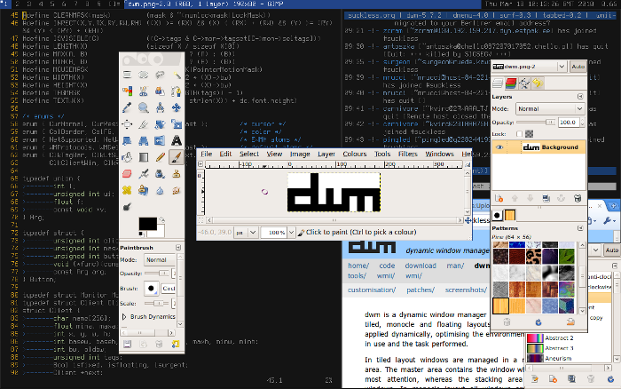

dwm is a dynamic window manager for X. It manages windows in tiled,
monocle and floating layouts. All of the layouts can be applied
dynamically, optimising the environment for the application in use and
the task performed.

In tiled layout windows are managed in a master and stacking area. The
master area contains the window which currently needs most attention,
whereas the stacking area contains all other windows. In monocle layout
all windows are maximised to the screen size. In floating layout windows
can be resized and moved freely. Dialog windows are always managed
floating, regardless of the layout applied.

Windows are grouped by tags. Each window can be tagged with one or
multiple tags. Selecting certain tags displays all windows with these
tags.

Each screen contains a small status bar which displays all available
tags, the layout, the number of visible windows, the title of the
focused window, and the text read from the root window name property,
if the screen is focused. A floating window is indicated with an empty
square and a maximised floating window is indicated with a filled
square before the windows title.  The selected tags are indicated with
a different color. The tags of the focused window are indicated with a
filled square in the top left corner.  The tags which are applied to one
or more windows are indicated with an empty square in the top left corner.

dwm draws a small customizable border around windows to indicate the
focus state.

-><-

Differences
-----------
In contrast to ion, larswm, and wmii, dwm is much smaller, faster and simpler.

* dwm has no Lua integration, no 9P support, no shell-based configuration, no remote control, and comes without any additional tools, such as for printing the selection or warping the mouse.
* dwm is only a single binary, and its source code is intended to never exceed 2000 SLOC.
* dwm doesn't distinguish between layers: there is no floating or tiled layer. Whether or not the clients of currently selected tag(s) are in tiled layout, you can rearrange them on the fly. Popup and fixed-size windows are always floating, however.
* dwm is customized through editing its source code, which makes it extremely fast and secure - it does not process any input data which isn't known at compile time, except window titles and status text read from the root window's name. You don't have to learn Lua/sh/ruby or some weird configuration file format (like X resource files), beside C, to customize it for your needs: you only have to learn C (at least in order to edit the header file).
* Because dwm is customized through editing its source code, it's pointless to make binary packages of it. This keeps its userbase small and elitist. No novices asking stupid questions. There are some distributions that provide binary packages though.
* dwm reads from the root window's name to print arbitrary status text (like the date, load, battery charge). That's much simpler than larsremote, wmiir and what not...
* **NEW** dwm creates a view for each Xinerama screen.

Links
-----
* [Man page](http://man.suckless.org/dwm/1/dwm)
* Mailing List: `dev+subscribe@suckless.org` ([Archives](http://lists.suckless.org/dev/)) ([Old Archives](http://lists.suckless.org/dwm/)) (see [community](http://suckless.org/common/community/) for details)
* IRC channel: #suckless at irc.oftc.net ([irc log](TODO))

Download
--------
* [MIT/X Consortium license](http://hg.suckless.org/dwm/raw-file/tip/LICENSE)
* [dwm 5.8.2](http://dl.suckless.org/dwm/dwm-5.8.2.tar.gz) (20kb) (20100604)
* See also [dmenu](http://tools.suckless.org/dmenu)

Development
-----------
dwm is actively developed in parallel to wmii. You can [browse](http://hg.suckless.org/dwm) its source code repository or get a copy using [Mercurial](http://www.selenic.com/mercurial/) with the following command:

	hg clone http://hg.suckless.org/dwm

Miscellaneous
-------------
* Optionally you can install [dmenu](http://tools.suckless.org/dmenu) to extend dwm with a wmii-like menu.
* Wikipedia [article about dwm](http://en.wikipedia.org/wiki/Dwm)

Related discussion
------------------
* <http://www.linuxjournal.com/content/going-fast-dwm>
* <http://www.linuxgoodies.com/review_dwm.html>
* <http://dobbscodetalk.com/index.php?option=com_myblog&show=dwm.html&Itemid=29>
* <http://tuxtraining.com/2008/10/20/an-introduction-to-tiling-window-managers>
* <http://www.iyiz.com/20-most-simple-and-cool-x-window-managers-for-linux/>
* <http://lbolla.wordpress.com/2010/01/08/dwm-restart/>
* <http://danielkaes.wordpress.com/2009/12/03/adding-a-pidgin-trayicon-to-dwm/>
* <http://openmindlifestyle.wordpress.com/2009/11/28/howto-compile-and-configure-dwm-tiling-window-manager-on-ubuntu/>
* <http://lsetc.wordpress.com/2009/11/27/gno-more-gnome/>
* <http://cdwillis.wordpress.com/2009/07/02/dwm-and-common-lisp/>
* <http://leanux.wordpress.com/2009/03/13/tiling-window-managers-reprise/>
* <http://afterstep13.wordpress.com/2008/10/14/less-is-more/>
* <http://steveno.wordpress.com/2007/05/30/dwm-and-slim/>
* <http://www.youtube.com/watch?v=F2sYPwuRPvc>
* <http://houst0n.wordpress.com/2009/12/20/dwm-the-dynamic-window-manager-for-solaris/>
* <http://stockground.net/?p=18>
* <http://maxwellequations.blogspot.com/2007/04/unix-review-dwm-dynamic-window-manager_17.html>
* <http://the-monkeymind.blogspot.com/2007/03/dwm-dynamic-window-manager-home-page-at.html>
* <http://tonytraductor.livejournal.com/120674.html>
* <http://www.halbmoendli.ch/blog/archive/2007/03/31/dwm-dynamic-window-manager.html>
* <http://peterstuifzand.nl/20060816212719.html>
