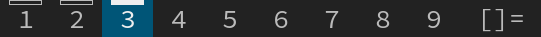

activetagindicatorbar
=====================

Description
-----------
This patch changes the rectangle indicating if a tag is used by a client into a
bar above the tag name.

Be sure to use a font which leaves enough space between the text of the tag name
and the top of the bar.

Download
--------
* [dwm-activetagindicatorbar-6.1.diff](dwm-activetagindicatorbar-6.1.diff) (15.1.2019)

Author
------
* Leon Plickat <leonhenrik[dot]plickat[at]stud[dot]uni-goettingen[dot]de>

