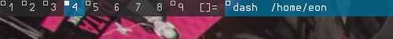

alpha
=====

Description
-----------
Allow dwm to have translucent bars, while keeping all the text on it opaque,
just like the [alpha-patch for st](//st.suckless.org/patches/alpha/).

Download
--------
* [dwm-alpha-6.1.diff](dwm-alpha-6.1.diff)
* [dwm-alpha-20180613-b69c870.diff](dwm-alpha-20180613-b69c870.diff)

Authors
-------
* Eon S. Jeon - &lt;esjeon@hyunmu.am>
* Laslo Hunhold - &lt;dev@frign.de> (6.1 port)
* Thomas Oltmann - &lt;thomas.oltmann.hhg@gmail.com> (20180613-b69c870 port)
