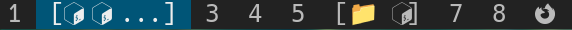

appicons
========

Description
-----------
Adds support for app icons which can be used instead of the tag indicator 
and tag name. This is configurable through an extra option in `rules`.

Icons should work out of the box. Emojis require a special font like 
[Noto Color Emoji](https://fonts.google.com/noto/specimen/Noto+Color+Emoji).
  
When one or more app icons are present in a tag, the tag name will be 
encapsulated with the outer separators (`outer_separator_beg` and 
`outer_separator_end`). Additionally, the icons of the tag will be 
separated between themselves by `inner_separator`.

Each tag can have a maximum of `truncate_icons_after` icons. 
After which the `truncate_symbol` will be displayed.
  

Download
--------
* [dwm-appicons-6.5.diff](dwm-appicons-6.5.diff) (2025-01-04)   
  
  

Author
------
* Rumen Mitov - <rumen.valmitov@gmail.com>
  

Inspiration
-----------
*  [XMonad's DynamicIcons](https://hackage.haskell.org/package/xmonad-contrib-0.18.1/docs/XMonad-Hooks-DynamicIcons.html)
