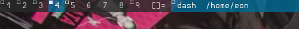

ARGBColor
==========

-><-

Description
-----------

Allow dwm to have translucent bars, while keeping all the text on it opaque,
just like [ARGB patch for st][1]. 

Download
--------

 * [dwm-argbcolor-git-20151219-3465bed.diff](dwm-argbcolor-git-20151219-3465bed.diff) (20160307)

Author
------

 * Eon S. Jeon <esjeon@hyunmu.am>

[1]: http://st.suckless.org/patches/argbbg

