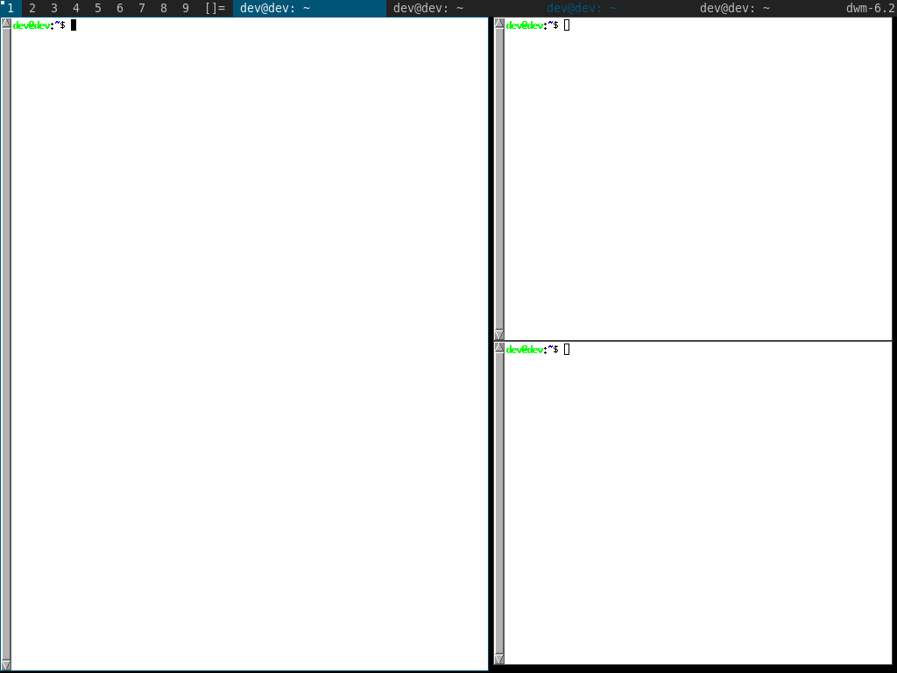

awesomebar
=====================

Description
-----------
This patch changes the taskbar to be more like awesome. To be specific, it:
* shows all tasks in the current tag in the taskbar at all times
* clicking on an unfocused window's title in the taskbar focuses that window
* clicking on a focused window's title in the taskbar hides that window
* clicking on a hidden window's title in the taskbar unhides and focuses that window
  
Since this patch relies on knowing how big everything is in the taskbar, make sure to adjust the buttonpress()/drawbar() functions to account for any space in the taskbar used by other patches (such as systray).

Download
--------
* [dwm-awesomebar-20191003-80e2a76.diff](dwm-awesomebar-20191003-80e2a76.diff) (10/03/2019)
* [dwm-awesomebar-6.2.diff](dwm-awesomebar-6.2.diff) (06/27/2019)

Authors
-------
* ornx <ornx[at]protonmail.com>
* Yegor Bayev <kodxpub@gmail.com> - patch to prevent visual glitches from uneven tabs count
