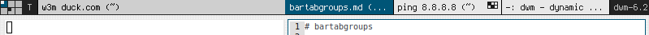

# bartabgroups

This patch draws one or multiple tab groups in the bar aligned with the current layout's vertical splits. This is similar to using multiple tabbed instances but saves vertical space since the bar area itself is used. 

## Layouts Functionality
- Monocole / Float: Available width is divided equally in a single tab bar.
- Tile / Deck: Available width is split into 2 tab bars seperated at master-stack split vertical.
- Centeredmaster / Column and other layouts: N tab bars drawn divided at vertical splits. Layout patches will generally work if windows are rendered in columns (patch works via looking at clients' x positions).

## Notes
- You should use this patch with a short statusline and ideally in conjunction with another tag area space saving patch such as [taggrid](/patches/taggrid) or [hidevacant](/patches/hide_vacant_tags).
- This patch works out of out of the box / aligns with gaps patches, use the define `BARTABGROUPS_FUZZPX`.
- This patch can optionally draw grid indicators on each tab similar to the taggrid patch indicating which tags each client is on, use the define `BARTABGROUPS_TAGSINDICATOR` to enable / disable this feature.
- To ignore / use a single tab bar group for a non-column layout - add an exception in the calculation code as was done for the float layout.

## Screenshot
Shown with [taggrid](/patches/taggrid) and gaps patch (both optional) in tile mode:

## Download
* [dwm-bartabgroups-6.2.diff](dwm-bartabgroups-6.2.diff) (10/13/2019)

## Author
- Miles Alan (m@milesalan.com)
