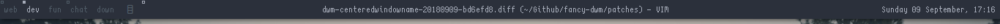

centeredwindowname
==================

Description
-----------

A little patch to center the WM_NAME of the currently selected window on the status bar.

Download
--------

* [dwm-centeredwindowname-20180909-bd6efd8.diff](dwm-centeredwindowname-20180909-bd6efd8.diff)

Authors
-------

* Sacules - <leociancalucas@gmail.com>
