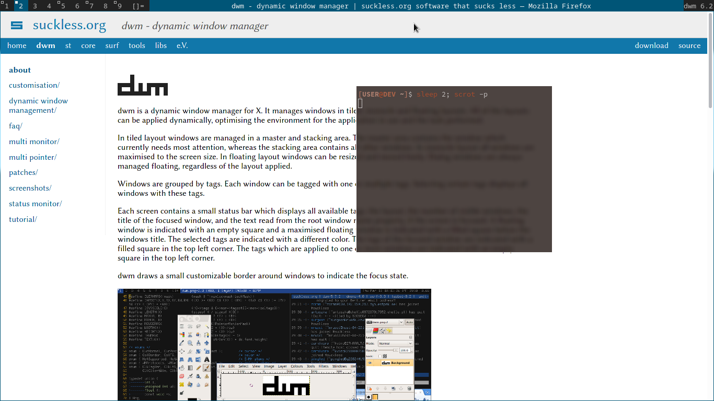
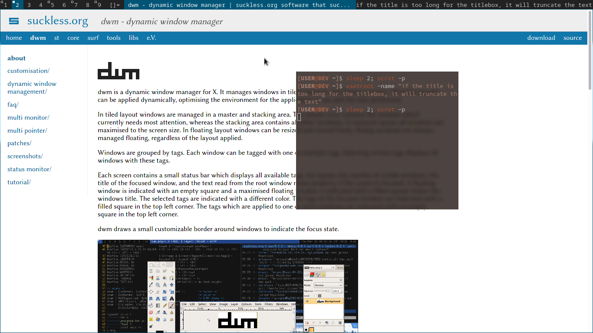

centertitle proportionally
==========================

Description
-----------
Center the title with proportion to the area that the title has, unlike the
other center title patches that center proportion to the screen size width
(`m->ww`).





If the title name is to long (if the title area it's too small for the title
string) it will back up to the default behaviour, which is to truncate the title.





Patchibility
------------
_Compatibility with other patches_


This is a simple enough patch and I'm leaving you with a logic text, I believe
you can figure out how to make it work with "X" patch.


In other notes I have [winicons](../winicons) compatible on my build.

Logic
-----
Imagine you are on a word processor (word, writter..). To center the text is as
easy as cliking a button. When I click it (there is no text) the input line
(`|`) is exactly on the middle of the page, which means that the `x` axis (or
the padding of the text, in this case the input line only) **is** the width of
the page divided by two (w / 2).

What if we add a character? The same logic can be applied. To make the text
center we need to **mesure** 'a distance' between the text and the edge of the
page. To do that we do the same thing above but now the `x` or padding isn't
only the width of the page, since we added a character we have to sutract the
width of that character on the width of the page. We want 2 result with the
same value to give the ilusion of a 'centered text'.

```
width of the page / 2 - width of the character / 2
```
in short:
```
w / 2 - TEXTW(title) / 2
```
where _title_ is a string.

```
( w - TEXTW(title) ) / 2
```

Okay, what if I have an icon?
```
( w - TEXTW(title) + iconwidth ) / 2
```


Download
--------
* [dwm-centertitle-proporcionally.diff](dwm-centertitle-proporcionally-6.2.diff)
* [github mirror](https://github.com/explosion-mental/Dwm/blob/main/Patches/dwm-centertitle-proporcionally-6.2.diff)

Author
------
* explosion-mental - <explosion0mental@gmail.com>
