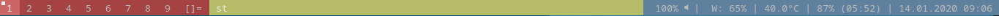

colorbar
========

Description
-----------
This patch lets you change the foreground and background color of every
statusbar element.

Simply change the RGB values in the config.def.h.

Download
--------
* [dwm-colorbar-6.2.diff](dwm-colorbar-6.2.diff)(2020-01-13)

* [dwm-colorbar-6.3.diff](dwm-colorbar-6.3.diff)(2022-06-27)

Author
------
* Lars Niesen - <lars.niesen@gmx.de>
* Nemo - <nemo2k@protonmail.com>