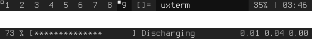

dualstatus
==========

Description
-----------
This patch will enable an extra status bar in dwm. The extra bar can be toggled along with the standard bar or independently.

The status bar text can be set as follows:
xsetroot -name "Top text;Bottom text"

Download
--------

 * [dwm-6.1-dualstatus.diff](dwm-6.1-dualstatus.diff) (4655b) (20130626)

Screenshot
----------

a simple dual status bar

Authors
-------
 * Andrew Milkovich - `<amilkovich at gmail dot com>`
