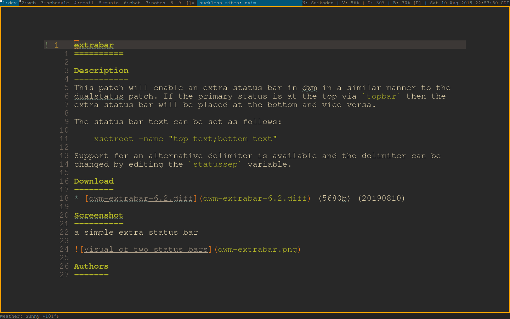

extrabar
==========

Description
-----------
This patch will enable an extra status bar in dwm in a similar manner to the
dualstatus patch. If the primary status is at the top via `topbar` then the
extra status bar will be placed at the bottom and vice versa.

The status bar text can be set as follows:

	xsetroot -name "top text;bottom text"

Support for an alternative delimiter is available and the delimiter can be
changed by editing the `statussep` variable.

Download
--------
* [dwm-extrabar-6.2.diff](dwm-extrabar-6.2.diff) (5680b) (2019.08.10)

Screenshot
----------
a simple extra status bar

Authors
-------
* Chip Senkbeil - `<chip@senkbeil.org>`
