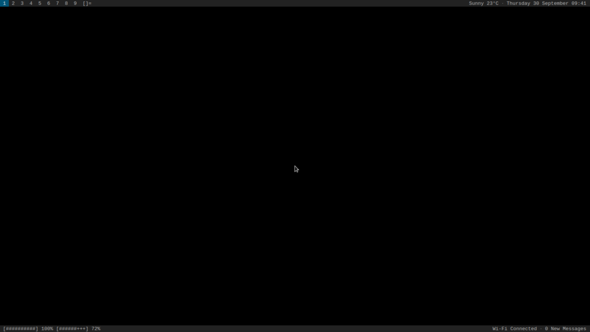
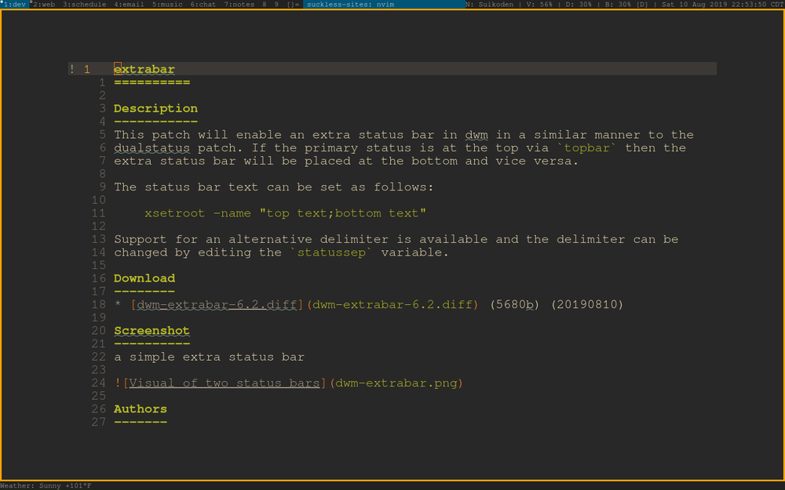

extrabar
==========

Description
-----------
This patch will enable an extra status bar in dwm, in a similar manner to the
[dualstatus](../dualstatus/) patch. If the standard status bar is at the top
via `topbar`, the extra status bar will be placed at the bottom and vice versa.

**Since the 20210930-a786211 version**

There is now support for separate left and right statuses, click functionality and toggling the extra
bar separately from the standard bar.

The statuses can be set as follows:

	xsetroot -name "standard status text;extra bar left status text;extra bar right status text"

If you don't want a status at the left of the extra bar, you can omit the text between the
separators so you have `;;` between the standard status text and the right status text. You
can change the separator by changing the `statussep` variable.

There are three clicking areas on the extra bar: the left status, the middle (between the statuses)
and the right status.

You can change the visibility for the extra bar by changing the `extrabar` variable. You can
toggle the extra bar using the `toggleextrabar` function, bound to `MODKEY+SHIFT+B`. If you
want the bars to toggle at the same time, set them to toggle with the same keybinding.

**Previous versions**

The status bar text can be set as follows:

	xsetroot -name "standard status text;extra bar status text"

Support for an alternative delimiter is available and the delimiter can be
changed by editing the `statussep` variable.

The text can be anchored to the left or right side of the screen by editing
the `extrabarright` variable (20210209 diff only).

Download
--------
* [dwm-extrabar-6.2-20190810.diff](dwm-extrabar-6.2-20190810.diff) (5680b) (2019.08.10)
* [dwm-extrabar-6.2-20210209.diff](dwm-extrabar-6.2-20210209.diff) (5639b) (2021.02.09)
* [dwm-extrabar-6.2-20210930-a786211.diff](dwm-extrabar-6.2-20210930-a786211.diff) (8817b) (2021.09.30)

Screenshots
-----------

**Since the 20210930-a786211 version**

**Previous versions**

a simple extra status bar

Authors
-------
* Chip Senkbeil - `<chip@senkbeil.org>`
* Finn Rayment - `<finn@rayment.fr>`
* Parker Wisslefield (20210930-a786211 version)
