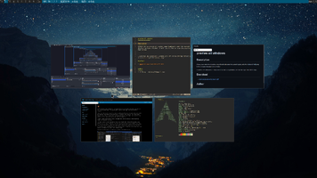

preview all windows
================

Description
-----------
Allows you to preview all window image thumbnails under the current display, and when clicked, it will jump to the corresponding application window

I used two x11 extensions, xcomposite's off-screen storage feature and xrender to get the window image

> [!WARNING]

> If you're using patches for fullscreen and hidewin, please follow the comments in my patches and adjust the code to suit the effects of other patches

> The project is still in the development stage, and there are still many problems, such as: without using a renderer like picom, the window image will not be available, but fortunately there is no crash

> (I'm sorry because I've been using picom and this issue didn't come to me until I was making diff)

Download
--------
* [dwm-preview-all-windows-6.5.diff](./dwm-preview-all-windows-6.5.diff)

Author
------
* HJ-Zhang - <hjzhang216@gmail.com>
