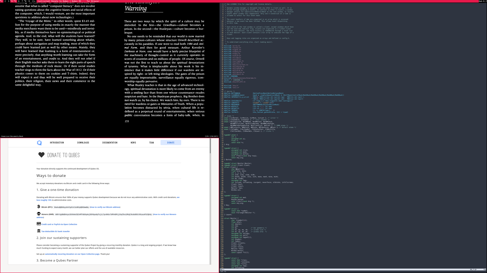
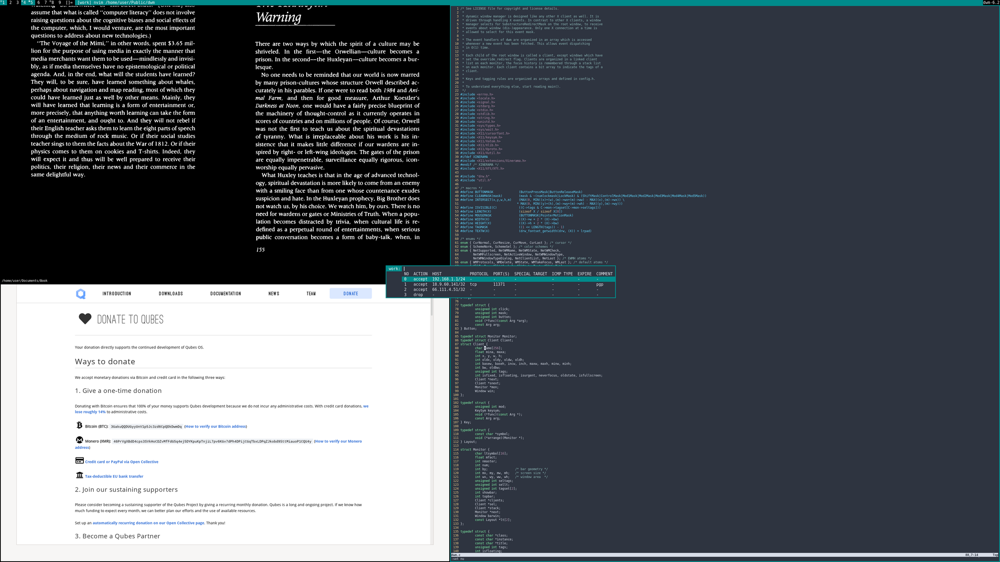

qubesdecorations
================

Description
-----------
This patch enables dwm to read [QubesOS](https://qubes-os.org)-specific window properties and use the
windowborders, titlebar and tagbar to indicate to the user what qube the
focused window belongs to.

Each qube-label gets its own SchemeSel colorscheme that can be conviniently configured in config.def.h

Download
--------
* [dwm-qubesdecorations-6.3.diff](dwm-qubesdecorations-6.3.diff) (2022-01-07)

Author
-------
* 3o14r473 - [fingerprint](E4FEE61C3B02F4CAB6D80CA7F105757D34BEFA98) [email](3o14@pm.me) [github](https://github.com/3o14r473) [moneroj](41rMoMLvk8hEJYP2vbv3dNUGzN95CLXoANAtmAVaUxzse5KfPjhkE7d4PUwh8kCkF16FwwqfZTmS4ZKmYCjrsFAcGXTPpwH)
