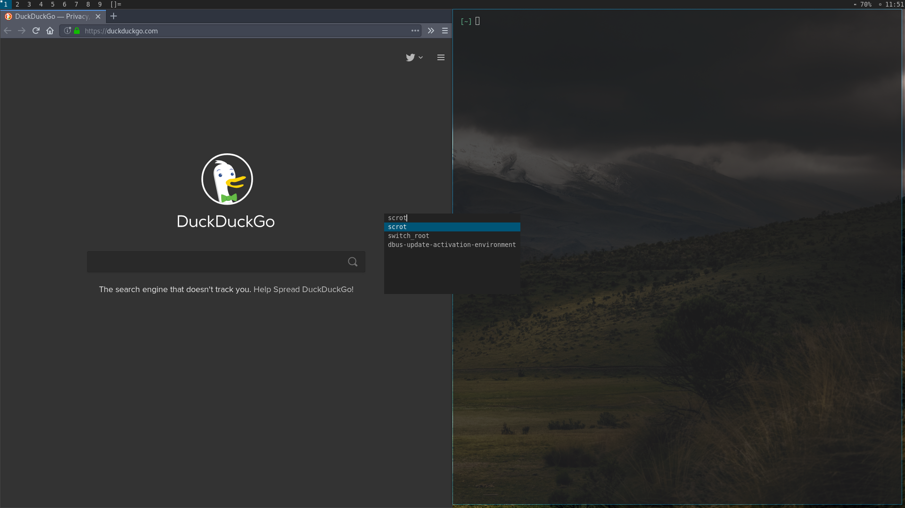

removetitle
============

Description
-----------
Remove the title of the currently selected client from the statusbar.
This is useful for people who find no value in displaying the title
and want to declutter their statusbar. Also it leads to simpler code
since this patch only removes code.

Download
--------
* [dwm-removetitle-6.2.diff](dwm-removetitle-6.2.diff)

Author
------
* Aleksandrs Stier - aleks.stier@icloud.com
