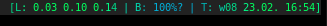

SGR in status text
==================

Description
-----------
Allows the use of CSI SGR escape sequences in the status bar text to change
text rendition. Currently supported are:

* color changes (either 16 or 256, depending on chosen patch)
* alternate font (ones listed in fonts[] array)
* reverse, underline, strikethrough, overline

Configuration
-------------
Download the patch and apply it according to the [general instructions](../).

Modify the barcolors definition in 'config.h' to suit your needs. For the 16
color version, you should have at least 16 colors defined.

Usage
-----
Add code to your status script to output CSI SGR codes. They take the form
ESC[1;2;3;4m.

* 0 resets all formatting
* 1 makes text bright (_not_ bold)
* 4 underlines
* 7 reverses
* 9 strike-through's
* 10-19 alternate font
* 53 overlines
* 30-37 sets foreground color
* 40-47 sets background color

In addition the 256 color version allows the use of: `ESC[38;5;123m` to set
foreground to color 123 (48 changes background).

### Example

With slstatus, you can have your date in bright red using:

	{ datetime, "\033[1;31m%s\e[0m",           "%F %T" },

For a more pointless example, you could combine slstatus -s with
[nyancat](https://inzg.it/nyancat/):

	slstatus -s | nyancat -2 | while read l; do xsetroot -name "$l"; done

And you'll get something like .

Download
--------
* [dwm-sgrstatus-20220223-6.3.diff](dwm-sgrstatus-20220223-6.3.diff)

For 256 color support, apply the following on top:

* [dwm-sgrstatus256-20220223-6.3.diff](dwm-sgrstatus256-20220223-6.3.diff)

Authors
-------
* Santtu Lakkala - <inz@inz.fi>
