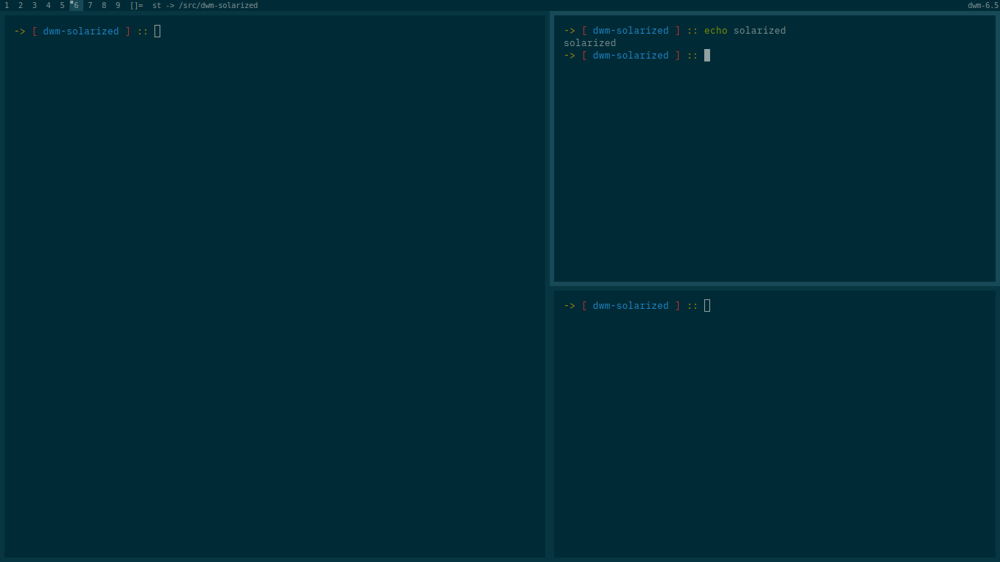

solarized
=========

Description
-----------
Solarized color scheme for dwm.
Original Solarized colors don't satisfy the count to theme dwm, so this patch
includes some additional colors.

Download
--------
* [dwm-solarized-6.5.diff](dwm-solarized-6.5.diff)

With xtheme patch
-----------------
With [xtheme](https://dwm.suckless.org/patches/xtheme/) patches you can use this
[additional setup](https://gitlab.com/GasparVardanyan/themes/-/blob/master/solarized-dark.xdefaults?ref_type=heads) to solarize dwm, st, dmenu and tabbed together.

Authors
-------
* [Ethan Schoonover](https://ethanschoonover.com/) (the original color palette)
* [Gaspar Vardanyan](https://gasparvardanyan.github.io/) (dwm theme)
