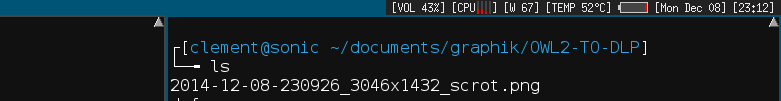

Status2d
========

Description
-----------
Status2d allows colors and rectangle drawing in your DWM status bar. 
See below an example of my status bar with multi-cpu and battery.

Download
--------
Get the patch from github: [https://github.com/sipi/dwm-status2d](https://github.com/sipi/dwm-status2d))

Direct download: [dwm-r35db6d-status2d.diff](dwm-r35db6d-status2d.diff)

apply it to dwm.c like so:

    patch -p1 dwm.c < dwm-*-status2d.diff

Usage
-----
* draw rectangle
Add ^rx,y,w,h^ in the status text.

* change color
Add ^c#FF0000^ in the status text.

* forward the x position for next drawing
Add ^f11^ in the status text.

Example
-------
xsetroot -name "dwmstatus ^c#FF0000^ in red with red rectangle ^r0,0,10,10^^f10^^c#FFFFFF^ and white text"

