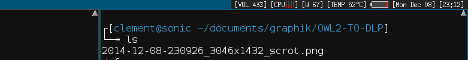

status2d
========

Description
-----------
Status2d allows colors and rectangle drawing in your DWM status bar.
See below an example of my status bar with multi-cpu and battery.

Download
--------

* [dwm-status2d-20161231-bb3bd6f.diff](dwm-status2d-20161231-bb3bd6f.diff)

Usage
-----
* ^rx,y,w,h^ : draw a rectangle.

* ^c#FF0000^ : set foreground color.

* ^f11^ : forward the x draawing cursor, only needed for drawings, not text.

* ^d^ : reset foreground color to SchemeNorm.

Example
-------
xsetroot -name "dwmstatus ^c#FF0000^ in red with red rectangle ^r0,0,10,10^^f10^^c#FFFFFF^ and white text"

Authors
-------
* [sipi](https://github.com/sipi)
* lhark - <lhark@ntymail.com> (bb3bd6f port)

