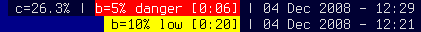

# COLORED STATUS TEXT #

## Description ##

This patch enables colored text in the status bar.  It changes the way colors are defined in config.h, allowing the user to define multiple color combinations for use in their status script.

## Configuration ##

Download the patch and apply it according to the [general instructions](.).

Modify the colors definition in 'config.h' to suit your needs.  Make sure to define at least 3 colors as they will be used for 'normal', 'selected', and 'urgent' windows, respectively.

## Usage ##

Add code to your status script to output the raw characters '\x03' to switch to the 'urgent' color, or '\x04' to switch to the 4th defined color, etc.  Note that the color indices in the status text are +1 from the definition in 'config.h' (because '\0' is the string terminator).  To switch back to the normal text color use '\x01'. To enter the raw character '\x01' in vim, press ctrl+v followed by x, 0, and 1 in that order. '\x01' gives the first character, which appears as a bold "A" on the screen to distinguish it from the regular character A.

### Example ###

The following definition in 'config.h':

    #define NUMCOLORS         4
    static const char colors[NUMCOLORS][ColLast][8] = {
      // border   foreground background
      { "#000033", "#dddddd", "#000033" },  // normal
      { "#000088", "#ffffff", "#000088" },  // selected
      { "#ff0000", "#000000", "#ffff00" },  // urgent/warning  (black on yellow)
      { "#ff0000", "#ffffff", "#ff0000" },  // error (white on red)
      // add more here
    };

Coupled with a matching status script produces the following:
  

A really silly example:

    echo -e "normal \x01 selected \x03 warning/urgent \x04 error \x01 back to normal text" | dwm

An example status script snippet to take advantage of the colors:

    status=""
    if [$batperc -le 10]; then
      # use "warning" color
      status+="\x03 BAT: $batperc"
    elif [$batperc -le 5]; then
      # use "error" color
      status+="\x04 BAT: $batperc"
    else
      # default is normal color
      status+="BAT: $batperc"
    fi

    # switch back to normal color for date
    status+="\x01| "+$(date)

    echo -e $status

## Download ##

 * [dwm-5.7.2-statuscolors.diff](historical/dwm-5.7.2-statuscolors.diff)
 * [dwm-5.8.2-statuscolors.diff](historical/dwm-5.8.2-statuscolors.diff)
 * [dwm-5.9-statuscolors.diff](dwm-5.9-statuscolors.diff)
