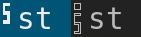
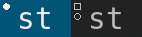

functionalgaps
==========

Description
-----------
This is a patch for [sticky](../sticky) users who want an indicator in their bar when a window is sticky. The icon will appear underneath the floating icon, and is highly customizable. The shape is filled in when you are on the sticky window's original tag(s), and appears as an outline otherwise.

* (All screenshots are shown with [fancybar](../fancybar) and [hidevacanttags](../hidevacanttags) for demonstration purposes)

This patch draws the indicator icon as a polygon using an added wrapper to handle drawing scaled polygons with X11. Because of this, the little icon is very versitile (although, that doesn't mean you will get good results). In fact, the icon can be changed just by editing the vertices stored in `stickyicon[]` in the config file. Some examples of alternate icons are shown below.

Default bookmark icon (looks by far the best on high and low-dpi displays)
* `stickyicon[] = { {0,0}, {4,0}, {4,4}, {2,3}, {0,4}, {0,0} };	/* represents the icon as an array of vertices like in grade school math */`
* `stickyiconbb = {4,4};			/* defines the bottom right corner of the bounding box of the polygon (origin is always 0,0) */`
* `#define STICKYICONSH boxw + (boxw * 6 / 7)	/* defines the height of the final, scaled polygon as it will be drawn. boxw is equal to the width of the shape */`

'S' icon (only readable on high-dpi displays)
* `stickyicon[]    = { {4,0}, {0,0}, {0,4}, {3,4}, {3,6}, {0,6}, {0,7}, {4,7}, {4,3}, {1,3}, {1,1}, {4,1}, {4,0} };`
* `stickyiconbb    = {4,7};`
* `#define STICKYICONSH boxw * 2`

Octogon icon
* `static const XPoint stickyicon[]    = { {1,0}, {2,0}, {3,1}, {3,2}, {2,3}, {1,3}, {0,2}, {0,1}, {1,0} };`
* `static const XPoint stickyiconbb    = {3,3};`
* `#define STICKYICONSH boxw`

Tip: The size of the icon (and thus, its resolution) is controlled by the fontsize used in your config file (same behavior as the floating indicator icon). This patch also works very well on high-dpi displays since they can show the detail of the tiny icon better. Simple icons also tend to look far better than complex ones.

Download
--------
* [dwm-stickyindicator-6.2.diff](dwm-stickyindicator-6.2.diff)
* [dwm-stickyindicator-fancybarfix-6.2.diff](dwm-stickyindicator-fancybarfix-6.2.diff) (this fix is for fancybar users, since there is a small conflict)

Author
------
* Timmy Keller <applesrcol8796@gmail.com>
