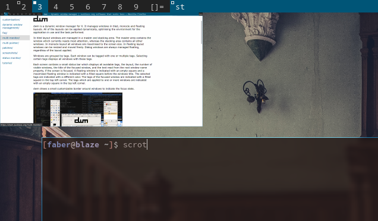

tag previews
================

Description
-----------
Allows you to see the contents of an already viewed tag. So a more accurate
description would be to re-view a tag.

This is done with Imlib2, so it is a dependency. This patch is extracted from
siduck76 [chadwm](https://github.com/siduck76/chadwm)

More info in the commit message of the patch.

Download
--------
* [dwm-tag-preview-6.3.diff](dwm-tag-preview-6.3.diff)
* [dwm-tag-preview-6.2.diff](dwm-tag-preview-6.2.diff)
* [codeberg mirror](https://codeberg.org/explosion-mental/demwm/src/branch/patches/dwm-tag-preview-6.3.diff)

Author
------
* explosion-mental - <explosion0mental@gmail.com>
