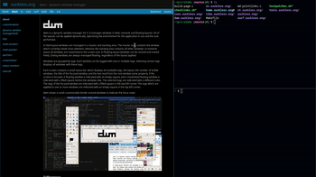

Tiledmove
================

Description
-----------
Patch to make the function `movemouse` not force clients to float.

Tiled clients when moved will swap with other tiled clients that
overlap with the cursor, and snap to other monitors.

Download
--------
* [dwm-tiledmove-20231210-b731.diff](dwm-tiledmove-20231210-b731.diff)

Author
-------
* Niki - <schat@cock.li>
