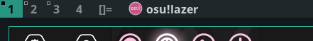

winicon
========

Description
-----------
**dwm-winicon** is a patch that enables dwm to show window icons.

It is recommended to enable the compiler flag: **-march=native** to gain better performance.

The patch is being managed and developed on this GitHub [repo](https://github.com/AdamYuan/dwm-winicon). If you discover any bugs or have any idea to optimize it, feel free to create an issue there.

Dependency
----------
The patch depends on Imlib2 for icon scaling, which can be easily installed in most distros.

Arch Linux:
	sudo pacman -S imlib2
Debian:
	sudo apt install libimlib2-dev

Configuration
-------------
	#define ICONSIZE 20   /* icon size in pixels */
	#define ICONSPACING 5 /* space (pixels) between icon and title */

Download
--------
* [dwm-winicon-6.2-v1.2.diff](dwm-winicon-6.2-v1.2.diff) (2021-07-13)

Author
------
* Adam Yuan - `<y13916619121@126.com>`
