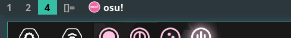

winicon
========

Description
-----------
**dwm-winicon** is a patch that enables dwm to show window icons.

It is recommended to enable compiler flags: **-march=native**, **-ffast-math** and **-faggressive-loop-optimizations** to gain better performance.

The project is being managed and developed on this GitHub [repo](https://github.com/AdamYuan/dwm-winicon). If you discover any bugs or have any idea to optimize it, feel free to create an issue there.

Configuration
-------------
	#define ICONSIZE 20   /* icon size in pixels */
	#define ICONSPACING 5 /* space (pixels) between icon and title */

Download
--------
* [dwm-winicon-6.2-v1.1.diff](dwm-winicon-6.2-v1.1.diff) (2021-07-10)

Author
------
* Adam Yuan - `<y13916619121 at 126 dot com>`
