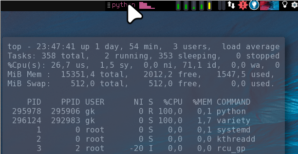

Using the `genmon` Applet
-------------------------

Any panel offers the possibility to include generic scripts output.
In `xfce4-panel` this is done by the panel item: "Generic Monitor" (genmon). It features output styled with pango markup and mouseover/onclick hooks.

Here are some `genmon` script collections:
- [xfce4-genmon-scripts](https://awesomeopensource.com/project/xtonousou/xfce4-genmon-scripts)
- [xfce4-genmon-scripts-2](https://github.com/almaceleste/xfce4-genmon-scripts)
- [xfce4-genmon-scripts-3](https://github.com/levimake/xfce4-genmon-panel-scripts)

Manual is [here](https://docs.xfce.org/panel-plugins/xfce4-genmon-plugin/start#usage).

Personally I wanted to have CPU monitor which shows the name of current high cpu eater(s) if present (next to current load by core) and on mouseover remembers the top output from the most recent high load situation in the past:

To get that, I cat the content of a file generated by this script, started in `autostart.sh` in the background:
[cpu_mon.py](cpu_mon.py).

