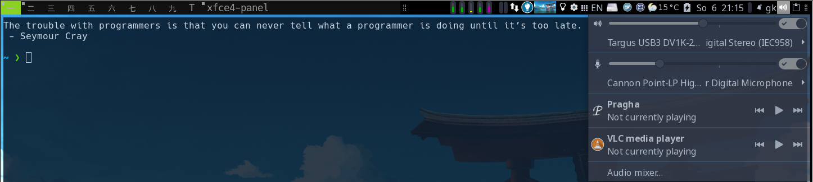

xfce4-panel
===========

Description
-----------

When xfce4 tools are on the system anyway, it might make sense to use the xfce4-panel in dwm.  
This patch modifies dwm, so that it treats the window with name `xfce4-panel` (default) 
as a status bar, i.e.:

- it never has borders
- it never has focus
- always has y=0
- it is never shown as active window in the tag indicators
- it is shown on all tags (via a tag rule in the config)

- Looks best when background is set to solid color, same as the dwm statusline (black in the example)
- The panel does act as systray for third party tools, i.e. the systray patch is no more required

The patch has been created against dwm6.2.

Download
--------

* [dwm-xfce4-panel-20210611-67d76bd.diff](dwm-xfce4-panel-20210611-67d76bd.diff) (2021-06-11)

Notes
-----

- The workspace switcher won't work (but dwm's tag switcher remains anyway on the left)
- The rest of xfce4's 40 or so panel apps _should_ work (if installed)
- Startup: A start via xinitrc should be fine. I use the [autostart](https://dwm.suckless.org/patches/autostart/) patch to start
  in background:

        sleep 0.3
        xfce4-panel --disable-wm-check

Panel Config
------------

Done via XFCE4 tools.

- Configure exactly one Panel, e.g. via `xfce4-settings-manager` -> `panel`
- At Tab Display:

    - Mode Horizontal  
    - Output: Your primary monitor (with y=0). Panel will stay there(!)   
    - Lock Panel: false   
    - Don't reserve space on borders: true   
    - Row size: 23 pixel, 1 row works for me   
    - Autom. increase the length: true   

The _content_ of the panel you configure "normally", i.e. by adding items in the panel's items tab or via CLI tools.

Having *different* panels in a xfce4 than in a dwm session with the same user I did not try.
I guess it should be possible via the backup and restore tool of the panel UI and [xfconf](https://docs.xfce.org/xfce/xfconf/xfconf-query).

Tip: *Never* try start `xfce4-session` from within dwm, the warning `Failed to connect to session manager` at panel startup is normal. It will try autoexplore your available workspaces - and conclude you have `2**9`, writing that back into the xfce4 config... I had to manually clean up the config via `xfconf`.

[Here](./genmon.html) is a usage example.

Author
-------
* Gunther Klessinger <gklessinger[at]gmx.de>

