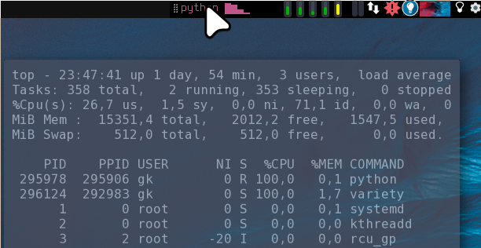

xfce4-panel
===========

Description
-----------

When xfce4 tools are on the system anyway, it might make sense to try `xfce4-panel` in dwm.

This patch modifies dwm, so that it treats any window with name `xfce4-panel` (default)
as a status bar, i.e.:

- it never has borders
- always has y=0 on the monitor it is shown at (see below)
- it is never shown as active window in the tag indicators
- it is shown on all tags (via a tag rule in the config)
- it is ignored on `focusstack` (MOD+j / MOD+k)

- The panel does also act as **systray** for third party tools
- Looks best when background is set to same color as the dwm statusline (black in the example)
- Using a compositor you can dimm or completely hide it, when not hovered

The patch has been created against dwm6.3 but will apply on 6.2 as well.  

Download
--------

* [dwm-xfce4-panel-20220306-d39e2f3.diff](dwm-xfce4-panel-20220306-d39e2f3.diff) (2022-03-06)

* Older version(s):

    - [dwm-xfce4-panel-20210701-67d76bd.diff](dwm-xfce4-panel-20210701-67d76bd.diff) (2021-07-01)

Notes
-----

- The workspace switcher won't work interactively, but dwm's interactive tag indicators remain on
  the left anyway.
- Some actions in the "session menu" applet (the one with your name as title) won't work out of the
  box. You might supply your own sub menu or modify the actions of the existing one.
- The rest of xfce4's 40 or so panel apps _should_ work (if installed) and also custom "applets"
  (see below) are working 
- Startup: A start via xinitrc should be fine. I use the [autostart](https://dwm.suckless.org/patches/autostart/) patch to start in background:

        sleep 0.3
        xfce4-panel --disable-wm-check

Panel Config
------------

**dwm**

In dwm `config.h` rules, the panel should be configured to be shown on all tags and floating - see the patch.

**xfce4-panel**

You can inspect and set attributes in the command line via `xconf-query` (you could also do it via
right mouse click and go to panel settings).

Here are *all* settings as I have it:

    ~ ❯ xfconf-query -c xfce4-panel -p /panels/panel-1 -lv
    /panels/panel-1/autohide-behavior  0
    /panels/panel-1/background-alpha   1
    /panels/panel-1/background-rgba    <<UNSUPPORTED>>
    /panels/panel-1/background-style   1
    /panels/panel-1/disable-struts     true
    /panels/panel-1/enter-opacity      100
    /panels/panel-1/icon-size          0
    /panels/panel-1/leave-opacity      45
    /panels/panel-1/length             5
    /panels/panel-1/length-adjust      true
    /panels/panel-1/nrows              1
    /panels/panel-1/output-name        Primary
    /panels/panel-1/plugin-ids         <<UNSUPPORTED>>
    /panels/panel-1/position           p=0;x=5000;y=0
    /panels/panel-1/position-locked    true
    /panels/panel-1/size               21
    /panels/panel-1/span-monitors      false

Discussion:

- `position`: Configure the position to be at `y=0` and `x=<a big number>` to get a panel top right
  (it will *use* the maximum possible x). See [here](https://forum.xfce.org/viewtopic.php?id=12149) for more on that.
        xfconf-query -c xfce4-panel -p /panels/panel-1/position -s 'p=0;x=5000;y=0' # -s: Set a value
- `leave-opacity`: Requires a compositor like picom. Set it to 0 to completely hide the panel when
  not hovered.
- `size`: 21 matches the height of dwm status bar
- `output-name`: Set to "Primary" instead of a fixed display name, in order to have support for
  multi monitor layouts.

**Multi Monitor Support**

I recommend using 

- [`arandr`](https://christian.amsuess.com/tools/arandr/) to *create* a new layout
- [`autorandr`](https://github.com/phillipberndt/autorandr) to store and *apply* a layout automatically after
  state changes (via `autorandr -c`). This also supports hooks after switching.

---

Below is a usage example for adding your own information into the panel.

Optional: Using the `genmon` Applet
-----------------------------------

Most panels offer the possibility to include generic scripts output.  
In `xfce4-panel` this is done by the panel item: "Generic Monitor" (genmon). It features output styled with pango markup and mouseover/onclick hooks.

Here are some `genmon` script collections:
- [xfce4-genmon-scripts](https://awesomeopensource.com/project/xtonousou/xfce4-genmon-scripts)
- [xfce4-genmon-scripts-2](https://github.com/almaceleste/xfce4-genmon-scripts)
- [xfce4-genmon-scripts-3](https://github.com/levimake/xfce4-genmon-panel-scripts)

Manual is [here](https://docs.xfce.org/panel-plugins/xfce4-genmon-plugin/start#usage).

Personally I wanted to have CPU monitor, which shows the name of current high cpu eater(s) if present (next to current load by core) and on mouseover remembers the top output from the most recent high load situation in the past:

To get that, I cat the content of a file generated by this script, started in `autostart.sh` in the background:
[cpu_mon.py](cpu_mon.py).

Author
-------
* Gunther Klessinger <gklessinger[at]gmx.de>

