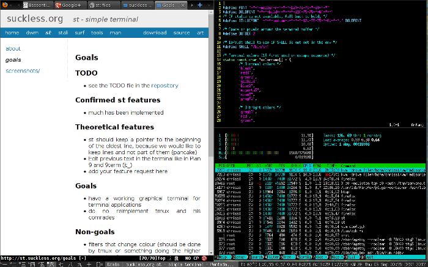

st is a simple terminal implementation for X.

-><-

What is wrong with xterm?
-------------------------
xterm is bloated and unmaintainable. Here's an excerpt from the README:

					Abandon All Hope, Ye Who Enter Here

	This is undoubtedly the most ugly program in the distribution.	It was one of
	the first "serious" programs ported, and still has a lot of historical baggage.
	Ideally, there would be a general tty widget and then vt102 and tek4014
	subwidgets so that they could be used in other programs.  We are trying to
	clean things up as we go, but there is still a lot of work to do.

Needless to say things have *not* changed, it's still ugly.
It has over 65K lines of code and emulates obscure and obsolete terminals
you will [never need](http://www.science.uva.nl/museum/tek4014.php).
The popular alternative, rxvt has *only* 32K lines of code. This is just
too much for something as simple as a terminal emulator; it's yet another
example of code complexity.

Current state
-------------
See the [TODO](http://git.suckless.org/st/plain/TODO) file for what needs to
be implemented or fixed.

What has been implemented:

* 256 colors
* most VT10X escape sequences
* utf8
* X11 copy/paste
* antialiased fonts (using fontconfig)
* fallback fonts
* resize
* shortcuts via config.h
* line drawing
* wide-character support
* serial line support
* XIM support
* clipboard handling
* utmp via utmp(1)

See the [goals](http://st.suckless.org/goals) section for more details.

Configuration
-------------

The configuration is done in `config.h` (like in dwm). See the comments in the
generated `config.h` to edit it to your needs.

FAQ
---
The FAQ is maintained in the st git repository and can be rad
[here](http://git.suckless.org/st/tree/FAQ).

Links
-----
* Mailing List: `dev+subscribe@suckless.org` [(Archives)](http://lists.suckless.org/dev)
* IRC channel: #suckless at irc.oftc.net

Download
--------
* [st 0.6](http://dl.suckless.org/st/st-0.6.tar.gz) (2015-07-07)
* [MIT/X Consortium license](http://git.suckless.org/st/plain/LICENSE)

Development
-----------
st is actively developed. You can [browse](http://git.suckless.org/st) its source code repository or get a copy using git with the following command:

	git clone http://git.suckless.org/st

Contributors
------------
* see the LICENSE file

