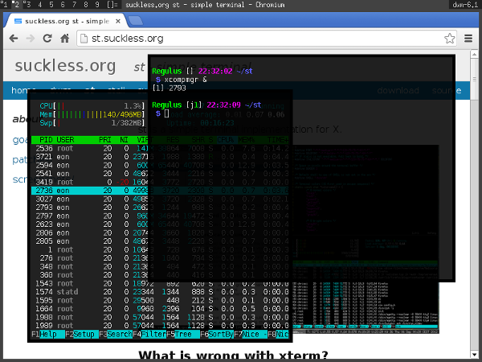

alpha
=====

Description
-----------

This patch allows users to change the opacity of the background.
Note that *you need an X composite manager* (e.g. compton, xcompmgr) to
make this patch effective.

Notes
-----

* The alpha value affects the default background only.
* The color designated by 'defaultbg' should not be used elsewhere.
* Embedding might fail after applying this patch.

Download
--------

* [st-alpha-0.4.1.diff](st-alpha-0.4.1.diff)
* [st-alpha-0.5.diff](st-alpha-0.5.diff)
* [st-alpha-0.6.diff](st-alpha-0.6.diff)
* [st-alpha-0.7.diff](st-alpha-0.7.diff)
* [st-alpha-20160727-308bfbf.diff](st-alpha-20160727-308bfbf.diff)
* [st-alpha-20170509-5a10aca.diff](st-alpha-20170509-5a10aca.diff)
* [st-alpha-20171221-0ac685f.diff](st-alpha-20171221-0ac685f.diff)
* [st-alpha-0.8.1.diff](st-alpha-0.8.1.diff)
* [st-alpha-20180616-0.8.1.diff](st-alpha-20180616-0.8.1.diff)

Authors
-------

* Eon S. Jeon - <esjeon@hyunmu.am>
* pr - <protodev@gmx.net> (0.5 port)
* Laslo Hunhold - <dev@frign.de> (0.6, git ports)
* Ivan J. - <parazyd@dyne.org> (git port)
* Matthew Parnell - <matt@parnmatt.co.uk> (0.7 port)
* Johannes Mayrhofer - <jm.spam@gmx.net> (0.8.1 port)
* Àlex Ramírez <aramirez@posteo.net> (0.8.1 pre-multiplication fix).
