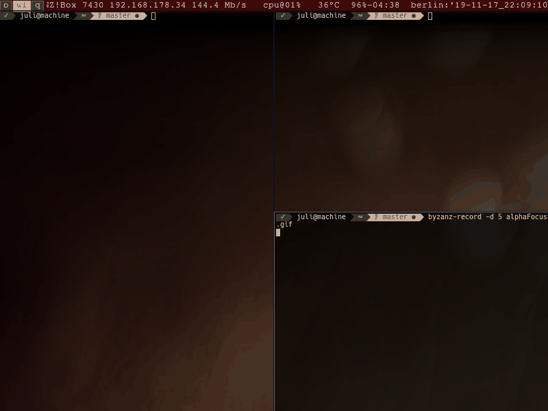

Alpha Focus Highlight Patch
===========================

Description
-----------
This patch allows the user to specify two distinct opacity values; one for the
focused- and one for unfocused windows' background.  This enables the user to
spot the focused window at a glance.

The *Alpha Highlight Focus Patch* patch is based on the
[Alpha Patch](//st.suckless.org/patches/alpha/),
which is already applied in the patch file below. Most of the work has been performed by the
original authors of the Alpha Patch.

Screenshot
----------

Contributions + Bug Reports
---------------------------
* [Issues](https://github.com/juliusHuelsmann/st/issues?q=is%3Aopen+is%3Aissue+label%3AalphaFocusHighlight)

Notes Alpha Patch
-----------------
* Note that *you need an X composite manager* (e.g. compton, xcompmgr) to make
  this patch effective.
* The alpha value affects the default background only.
* The color designated by 'defaultbg' should not be used elsewhere.
* Embedding might fail after applying this patch.

Notes
-----
* In i3WM, the focus event is triggered twice for one specific window on a workspace (root);
  hence the alpha values are applied twice which appears as blinking.
* The patch is applied both to a non-patched version and to a patched version of st
  and can be tried out [here](https://github.com/juliusHuelsmann/st).

Download
-----------------------------------

## Based on commit `2b8333f` of `st` (Okt 2019).
*All versions (from old to new)*:
* [Version 1.0 (attached)](st-alphafocushighlight-20191107-2b8333f.diff)
* [Version 1.0 (Github)](https://github.com/juliusHuelsmann/st/releases/download/patchesV3/st-alphaFocusHighlight-20191107-2b8333f.diff)
* [Version1.1 (attached)](st-alphaFocusHighlight-20191218-2b8333f.diff)
* [Version1.1 (Github)](https://github.com/juliusHuelsmann/st/releases/download/patchesV3/st-alphaFocusHighlight-20191218-2b8333f.diff)
* [Version1.2 (attached)](st-alphaFocusHighlight-20200212-2b8333f.diff)
* [Version1.2 (Github)](https://github.com/juliusHuelsmann/st/releases/download/patchesV3/st-alphaFocusHighlight-20200212-2b8333f.diff)

*Most Recent*:
* [st-alphaFocusHighlight-20200212-2b8333f.diff (Github)](https://github.com/juliusHuelsmann/st/releases/download/patchesV3/st-alphaFocusHighlight-20200212-2b8333f.diff)

## Based on commit `cd78575` of `st` (February 2020).
*All versions (from old to new)*:
* [Version 1.2 (attached)](st-alphaFocusHighlight-20200216-26cdfeb.diff)

*Most Recent*:
* [st-alphaFocusHighlight-20200216-26cdfeb.diff (Github)](https://github.com/juliusHuelsmann/st/releases/download/patchesV3/st-alphaFocusHighlight-20200216-26cdfeb.diff)

Note that patch errors can occur when the code in the st repo is updated. Please report [an
Issue](https://github.com/juliusHuelsmann/st/issues) or contribute a merged patch in that case.

Authors of the Alpha Patch
--------------------------
* Eon S. Jeon - <esjeon@hyunmu.am>
* pr - <protodev@gmx.net> (0.5 port)
* Laslo Hunhold - <dev@frign.de> (0.6, git ports)
* Ivan J. - <parazyd@dyne.org> (git port)
* Matthew Parnell - <matt@parnmatt.co.uk> (0.7 port)
* Johannes Mayrhofer - <jm.spam@gmx.net> (0.8.1 port)
* Àlex Ramírez <aramirez@posteo.net> (0.8.1 pre-multiplication fix).

Authors of the Alpha-Focus Patch
--------------------------------
* [Julius Hülsmann](https://github.com/juliusHuelsmann) - <juliusHuelsmann [at] gmail [dot] com>
* [glpub](https://github.com/glpub): Fix: erroneous color reset
* [Milos Stojanovic](https://github.com/M4444): Code formatting fix
