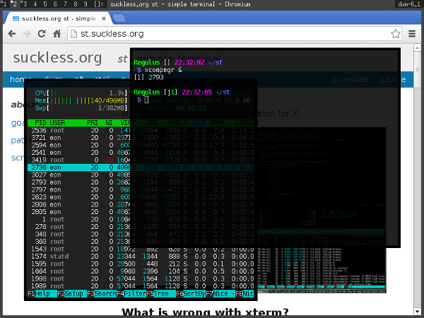

argbbg
======

-><-

## Description ##
This patch allows users to change the opacity of the background.
Note that **you need an X composite manager** to make this patch effective. (e.g. compton, xcompmgr)

## Important Notes ##
 - The alpha value affects the default background only.
 - The color designated by `defaultbg` should not be used elsewhere.
 - Embedding might fail after applying this patch.

## Download ##
 * [st-0.4.1-argbbg.diff](st-0.4.1-argbbg.diff)
 * [st-0.5-argbbg.diff](st-0.5-argbbg.diff)
 * [st-git-20141122-argbbg.diff](st-git-20141122-argbbg.diff)
 * [st-git-20150601-argbbg.diff](st-git-20150601-argbbg.diff)

## Authors ##
 * Eon S. Jeon - esjeon@hyunmu.am
 * pr - protodev@gmx.net (st-0.5 port)
 * Juan Aguilar - aritmeeul@gmail.com (st-git-20141122 port)
 * Laslo Hunhold - dev@frign.de (st-git-20150601 port)
