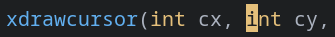

color-cursor
============

Description
-----------
Turns your cursor's background into whatever color the character you're currently on is (much like alacritty). Some say the effeect is very appealing:)

Notes
-----

~~Might be~~ Is incomplete - I'm new and suggestions are very welcome!

- Default cursor is not shown (e.g. in (neo)vim INSERT mode)
- Probably not all cases yet covered
- Magic numbers used - would probably be best to avoid
- Performance degradation considerations?

Download
--------
* [st-cursor-color-0.8.4.diff](st-cursor-color-0.8.4.diff)

Authors
-------
* Kipras Melnikovas <kipras@kipras.org>
