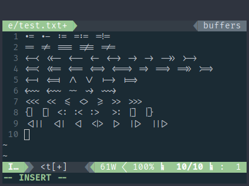

Ligature support
================

Description
-----------
This patch adds proper drawing of ligatures.

The code uses Harfbuzz library to transform original text of a single line to a list of glyphs with ligatures included.

Example
-------
Taken with Fira Code Regular 14pt:

Notes
-----
* The patch adds additional dependency on Harfbuzz library and headers.
* Original patch was made for clean version of ST from latest master commit. It is not 100% compatible with Scrollback patches, so I made a modified version that you can apply on top of a Scrollback patch.
* Due to some limitations in drawing engine, ligatures will break when crossing colors, font styles or selection. They will still render properly as separate symbols, just not as ligatures.

Download
--------
* [st-ligatures](st-ligatures-20200405-28ad288.diff)
* [st-ligatures-scrollback](st-ligatures-scrollback-20200405-28ad288.diff)

Authors
-------
* Alexander Rogachev - [https://github.com/cog1to](https://github.com/cog1to)
