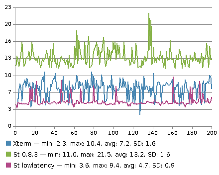
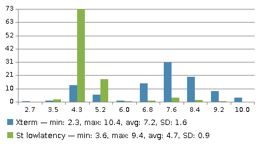

lowlatency
==========

Summary
-------
Trivial patch that reduces input/output latency by selectively disabling the
built in frame rate limiting for `KeyPress` events.

Description
-----------
According to the popular essay
[Typing with pleasure](https://pavelfatin.com/typing-with-pleasure/)
by Pavel Fatin public available research data comes to the conclusion that
"Delay of visual feedback on a computer display have important effects on
typist behavior and satisfaction" and even though not necessarily consciously
perceived can have an significant impact on typing speed, error rate, eye and
muscle strain and the required amount of conscious attention.

Several publications \[[1](https://lwn.net/Articles/751763/)\],\[
[2](https://danluu.com/term-latency/)\] that benchmarked latency metrics for
terminal emulators established that the latency performance of St is
consistently worse than that of XTerm or even that of Emacs eshell.
The reason for this is that st employs frame rate limiting configured by the
variable `xfps` in config.h in order to keep st from slowing down applications
with high output bandwidth.

This patch disables the frame rate limiting for events that are caused by
keyboard input but keeps it intact for all other events and consequently should
not harm throughput performance.

Benchmarks
----------
These benchmarks are done using generic `amdgpu` drivers on Linux with default
configuration on a 60Hz refresh rate display employing the utility
[Typometer](https://github.com/pavelfatin/typometer) to measure the latency.

Throughput measured by time it takes to cat a 50MB file containing random data:

	Terminal	real	user	sys
	--------------------------------------
	XTerm		7.853s	0.255s	0.819s
	St 0.8.3	4.347s	0.246s	0.655s
	St lowlatency	4.371s	0.254s	0.638s

**Conclusion**: The results show that the patch improves latency to the point 
that it now beats previous leader XTerm without having impact on throughput.

Notes
-----
* This patch will most probably show no effect if used in conjunction with a
compositor or any driver configuration that enforces global vsync.

* In rare cases you might experience tearing while typing.

Download
--------
* [st-lowlatency-0.8.3.diff](st-lowlatency-0.8.3.diff)

Authors
-------
* Matthias Schoth - <mschoth@gmail.com>
