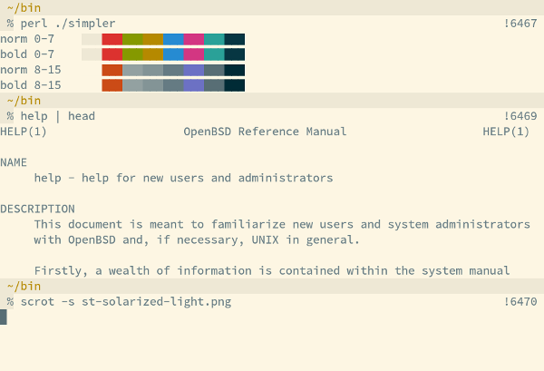
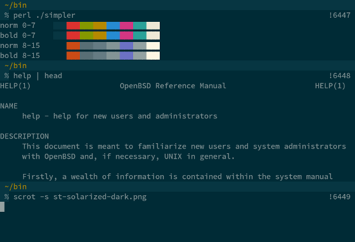

solarized
=========

Description
-----------

[Solarized](http://ethanschoonover.com/solarized) is a color scheme by
Ethan Schoonover which exists in a dark and a light variant.  These
patches make the Solarized color scheme available for st.

Notes
-----

Once applied, only the terminal colors are changed.  For applications
such as tmux or vim, you may need to
[adjust the colors there as well](https://bbs.archlinux.org/viewtopic.php?id=164108).

Example
-------

-><-

-><-

The font used is Source Code Pro.

Download
--------

To get correct colors, you first need to apply the following patch
to disable lighting up bold colors.

 * [st-no_bold_colors-0.5.diff](st-no_bold_colors-0.5.diff)
 * [st-no_bold_colors-0.6.diff](st-no_bold_colors-0.6.diff)
 * [st-no_bold_colors-git-20160620-528241a.diff](st-no_bold_colors-git-20160620-528241a.diff)

Choose one of the following patches to get either the light
or the dark color scheme:

*Light*:

 * [st-solarized-light-0.5.diff](st-solarized-light-0.5.diff)
 * [st-solarized-light-0.6.diff](st-solarized-light-0.6.diff)
 * [st-solarized-light-git-20160620-528241a.diff](st-solarized-light-git-20160620-528241a.diff)

*Dark*:

 * [st-solarized-dark-0.5.diff](st-solarized-dark-0.5.diff)
 * [st-solarized-dark-0.6.diff](st-solarized-dark-0.6.diff)
 * [st-solarized-dark-git-20160620-528241a.diff](st-solarized-dark-git-20160620-528241a.diff)

*Both (swap between light/dark with F6)*:

 * [st-solarized-both-git-20160709-528241a.diff](st-solarized-both-git-20160710-528241a.diff)

Authors
-------

 * Nils Reuße - nilsreusse@gmail.com
 * Laslo Hunhold - dev@frign.de (0.5, 0.6, git ports)
 * Ryan Roden-Corrent - ryan@rcorre.net (both)
