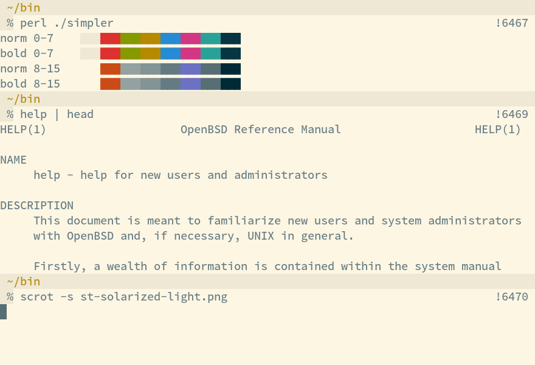
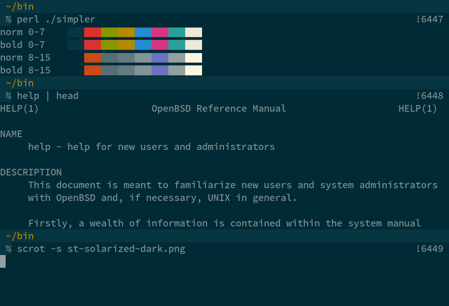

Solarized color scheme
======================

Description
-----------

[Solarized][1] is a color scheme by Ethan Schoonover and exists in a
dark and a light variant.  These patches make the solarized colors
available on st.

Notes
-----

No matter if you choose the light or dark theme, to get the correct
colors, you *always* have to apply the [patch to st.c][7] (if you're
using the latest git version of st, use [this patch to st.c][3]).  Then,
apply one of the patches for either the [light][4] or the [dark][5]
version of solarized.

These patches apply to the latest git of st, but should apply to older
versions as well.

Once applied, only the terminal colors are changed.  For applications
such as tmux or vim, you may need to adjust the colors there as well.
You find more information in my [thread][2] at the arch linux forums.

Example
-------

The font is [Source Code Pro][6].

Download
--------

 * [st-0.5-no-bold-colors.diff][7]
 * [st-no-bold-colors.diff][3]
 * [st-solarized-light.diff][4]
 * [st-solarized-dark.diff][5]

[1]: http://ethanschoonover.com/solarized
[2]: https://bbs.archlinux.org/viewtopic.php?id=164108
[3]: st-no-bold-colors.diff
[4]: st-solarized-light.diff
[5]: st-solarized-dark.diff
[6]: http://en.wikipedia.org/wiki/Source_Code_Pro
[7]: st-0.5-no-bold-colors.diff

Author
------

 * Nils Reu&szlig;e - nilsreusse @ gmail
