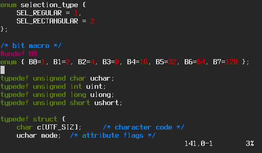

Solarized
=========

Description
-----------

This patch applies the "solarized" color scheme for xterm (16 colors),
found in [1] in the file "xresources-colors-solarized/Xresources"
on the color scheme's website [2].

Notes
-----

There exists a more extensive patch [3], which provides a
dark and a light scheme.

I'll provide more information when I've looked into it myself.

Example
-------

Screenshot that displays all 16 colors nicely coming soon…

More examples found on [2].

Download
--------

* [st-0.4.1-solarized_dark.diff][0]

[0]: st-0.4.1-solarized_dark.diff
[1]: http://ethanschoonover.com/solarized/files/solarized.zip
[2]: http://ethanschoonover.com/solarized
[3]: https://gist.github.com/drm00/5712443

Author
------

 * Michael Hauser - aware water @ gmail
