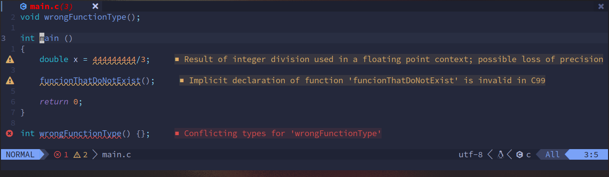

undercurl
=========

Description
-----------
This patch adds support for special underlines. It allows the use of the
following [SGR](https://en.wikipedia.org/wiki/ANSI_escape_code#SGR) parameters:
* 4:x - Where x can be 0 (No underline), 1-2 (Straight), 3 (Curly/Wavy)
* 58:5:x - Where x is the index of one of the terminal colors, up to 255, that the underline will be drawn with.
* 58:2:r:g:b - Where r, g and b are the red, green and blue color values of the underline respectively.
* 59 - Resets the underline color to the foreground color.

Notes
-----
These escape codes aren't standard, but they are supported by most other
terminal emulators, as well as many terminal programs (Such as Vim).

Download
--------
* [st-undercurl-0.8.4.diff](st-undercurl-0.8.4.diff)

Authors
-------
* HexOctal - ([github.com/hexoctal](github.com/hexoctal)) <hex0octal@gmail.com>
