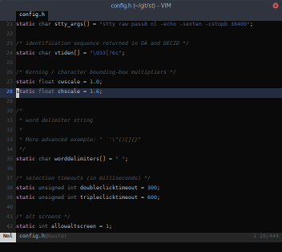
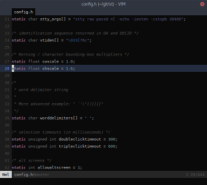

vertcenter
==========

Description
-----------

Vertically center lines in the space available if you have set a larger
chscale in config.h.

Before:

After:

Download
--------

 * [st-vertcenter-0.7.diff](st-vertcenter-0.7.diff)
 * [st-vertcenter-20160819-023225e.diff](st-vertcenter-20160819-023225e.diff)

Authors
-------

 * Doug Whiteley - <dougwhiteley@gmail.com>
