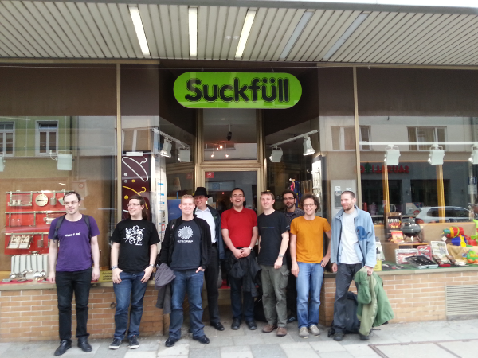

suckless conference 2015, Budapest
==================================

slcon2 will be held in Budapest on Oct 30-31 2015.

This time it'll be a conference for invited participants *only*.

Call for Papers
---------------

Among suckless.org fellows and contributors who will receive an official
invitation until end of Feb 2015, there are *limited* places left for
interested participants.

However to be accepted to attend, interested participants must submit their
paper proposal for talks between 20 and 60 minutes until the CfP deadline

*30. April 2015*

Good luck and looking forward!

suckless conference 2013, Munich
================================

Saturday 22 June 2013
=====================

        LMU MÜNCHEN (Ludwig-Maximilians-Universität)
        Theresienstr 39
        80333 München

        Room A027 / Raum A027

-><-

Talks
-----
* 10.00am-10.40am: Welcome the future of dwm, Anselm R Garbe

        Anselm presented his plan about the next steps of the dwm
        development. Stripped down videos can be found at
        http://mirror.netbeisser.de/slcon2013

<iframe width="560" height="315" src="http://www.youtube.com/embed/qvmYo7Bhm0Y" frameborder="0" allowfullscreen></iframe>

* [PDF slides](/slcon13.pdf)

* 10.40am-11.20am: st - the past and future, Christoph Lohmann

        Christoph presented his plan about the next steps of st
        development.

Part 1

<iframe width="560" height="315" src="http://www.youtube.com/embed/4C7LgG6rl6E" frameborder="0" allowfullscreen></iframe>

Part 2

<iframe width="560" height="315" src="http://www.youtube.com/embed/Lr7OEXw7huE" frameborder="0" allowfullscreen></iframe>

* [PDF slides](/20h_on_st.pdf)

* 11.45am-13.00am: Bugs found by musl, Szabolcs Nagy

        Szabolcs picked a few issues found by musl and to show how a new libc can be
        (and is) beneficial.

Part 1

<iframe width="560" height="315" src="http://www.youtube.com/embed/m6V-l-9_39E" frameborder="0" allowfullscreen></iframe>

Part 2

<iframe width="560" height="315" src="http://www.youtube.com/embed/gVdC8ebn5Vw" frameborder="0" allowfullscreen></iframe>

Part 3

<iframe width="560" height="315" src="http://www.youtube.com/embed/sNSQ0hQFSK0" frameborder="0" allowfullscreen></iframe>

* [Slides](http://port70.net/~nsz/slcon/bugs_talk.html)

* 2.40pm-3.20pm: runit and ignite, Christian Neukirchen

        Christian presented runit and ignite and discussed if these systems
        are in line with the suckless philosophy.

Part 1

<iframe width="560" height="315" src="http://www.youtube.com/embed/wIziZlFHshE" frameborder="0" allowfullscreen></iframe>

Part 2

<iframe width="560" height="315" src="http://www.youtube.com/embed/u1JXOs4OIak" frameborder="0" allowfullscreen></iframe>

* 3.20pm-4.20pm: The costs of abstraction, Szabolcs Nagy

        Szabolcs discussed why C is still the only serious programming language.

Part 1

<iframe width="560" height="315" src="http://www.youtube.com/embed/gWuNmgjRnP0" frameborder="0" allowfullscreen></iframe>

Part 2

<iframe width="560" height="315" src="http://www.youtube.com/embed/b-Ik1oONaqU" frameborder="0" allowfullscreen></iframe>

Part 3

<iframe width="560" height="315" src="http://www.youtube.com/embed/KeQp7CaK1s0" frameborder="0" allowfullscreen></iframe>

Part 4

<iframe width="560" height="315" src="http://www.youtube.com/embed/vEJl_H9gK3k" frameborder="0" allowfullscreen></iframe>

* [Slides](http://port70.net/~nsz/slcon/abstraction_talk.html)

* 4.20pm-4.50pm: The suckless web ideas, Christoph Lohmann

        Christoph discussed suckless web ideas.

<iframe width="560" height="315" src="http://www.youtube.com/embed/Dnr4sXArCwI" frameborder="0" allowfullscreen></iframe>

* [PDF slide](/20h_on_surf.pdf)

* 4.50pm-5.15pm: stali and other stuff, Anselm R Garbe

<iframe width="560" height="315" src="http://www.youtube.com/embed/Zu9Qm9bNMUU" frameborder="0" allowfullscreen></iframe>

* [PDF slides](/slcon13.pdf)
