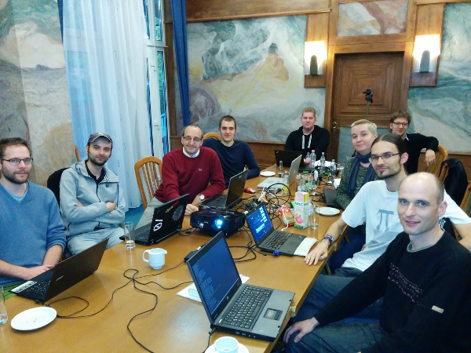

suckless conference 2015, Budapest
==================================

-><-

Friday, 2015-10-30
==================

Talks
-----

(11:00-11:15) *Welcome*, Anselm R Garbe

> Anselm opened slcon2 and gave an overview on the final conference schedule.

<video width="600" height="338" controls="" style="display:block;margin:0 auto" poster="http://dl.sta.li/slcon/2015/slcon-2015-00-arg-welcome.png">
        <source src="http://dl.sta.li/slcon/2015/slcon-2015-00-arg-welcome.webm" type="video/webm">
	<a href="http://dl.sta.li/slcon/2015/slcon-2015-00-arg-welcome.webm">slcon-2015-00-arg-welcome.webm</a>
</video>

(11:15-12:00) *suckless core - A suckless userspace foundation*, Laslo Hunhold

> This talk focused on recent developments in the suckless core
  programs, the design and motivation behind them and which issues had been
  faced along the way, including ditching POSIX in some places in favor of
  suckless design principles and consistency.
  Current issues and future plans were discussed in the last part.

<video width="600" height="338" controls="" style="display:block;margin:0 auto" poster="http://dl.sta.li/slcon/2015/slcon-2015-01-frign-suckless_core.png">
        <source src="http://dl.sta.li/slcon/2015/slcon-2015-01-frign-suckless_core.webm" type="video/webm">
	<a href="http://dl.sta.li/slcon/2015/slcon-2015-01-frign-suckless_core.webm">slcon-2015-01-frign-suckless_core.webm</a>
</video>

(12.00-12:45) *stali 2015*, Anselm R Garbe

<video width="600" height="338" controls="" style="display:block;margin:0 auto" poster="http://dl.sta.li/slcon/2015/slcon-2015-02-arg-stali_2015.png">
        <source src="http://dl.sta.li/slcon/2015/slcon-2015-02-arg-stali_2015.webm" type="video/webm">
	<a href="http://dl.sta.li/slcon/2015/slcon-2015-02-arg-stali_2015.webm">slcon-2015-02-arg-stali_2015.webm</a>
</video>

(12:45-13:45) Lunch

(13:45-14:30) *new suckless tools*, Anselm R Garbe

<video width="600" height="338" controls="" style="display:block;margin:0 auto" poster="http://dl.sta.li/slcon/2015/slcon-2015-03-arg-new_suckless_tools.png">
        <source src="http://dl.sta.li/slcon/2015/slcon-2015-03-arg-new_suckless_tools.webm" type="video/webm">
	<a href="http://dl.sta.li/slcon/2015/slcon-2015-03-arg-new_suckless_tools.webm">slcon-2015-03-arg-new_suckless_tools.webm</a>
</video>

(14:30-15:30) *Farbfeld - Rethinking image-formats*, Laslo Hunhold

> This talk discussed the deficiencies of the RGBA color space and
  presented the Farbfeld format to store images in a device independent
  way using the Lab color space.
  Additionally, an alternative to incorporated, namely imposed, image
  compression was discussed, evaluating the advantages over other image
  formats using different kinds of images.

<video width="600" height="338" controls="" style="display:block;margin:0 auto" poster="http://dl.sta.li/slcon/2015/slcon-2015-04-frign-farbfeld.png">
        <source src="http://dl.sta.li/slcon/2015/slcon-2015-04-frign-farbfeld.webm" type="video/webm">
	<a href="http://dl.sta.li/slcon/2015/slcon-2015-04-frign-farbfeld.webm">slcon-2015-04-frign-farbfeld.webm</a>
</video>

(15:30-16:00) Coffee/Tea break

(16:00-16:30) *suckless.org e.V.*, Anselm R Garbe

> Anselm presented the idea of suckless.org e.V.[1][1] and asked
  attendees to join.

<video width="600" height="338" controls="" style="display:block;margin:0 auto" poster="http://dl.sta.li/slcon/2015/slcon-2015-05-all-suckless_ev.png">
        <source src="http://dl.sta.li/slcon/2015/slcon-2015-05-all-suckless_ev.webm" type="video/webm">
	<a href="http://dl.sta.li/slcon/2015/slcon-2015-05-all-suckless_ev.webm">slcon-2015-05-all-suckless_ev.webm</a>
</video>

(16:30-17:30) *suckless.org foundation*, All

(17:30-19:00) Refresh break / check your rooms

(19:00-) Late night social event in Budapest

Saturday, 2015-10-31
====================

Talks
-----

(10:30-10:45) *Opening of day 2*, Anselm R Garbe

<video width="600" height="338" controls="" style="display:block;margin:0 auto" poster="http://dl.sta.li/slcon/2015/slcon-2015-06-arg-opening_of_day_2.png">
        <source src="http://dl.sta.li/slcon/2015/slcon-2015-06-arg-opening_of_day_2.webm" type="video/webm">
	<a href="http://dl.sta.li/slcon/2015/slcon-2015-06-arg-opening_of_day_2.webm">slcon-2015-06-arg-opening_of_day_2.webm</a>
</video>

(10:45-11:30) *Simple Jabber - Divide And Conquer XMPP*, Jan Klemkow ([paper](/jan_on_sj.pdf))

> The Extensible Messaging and Presence Protocol ([XMPP][2]) is like the web. It is
  far too complex to be implemented in one program with the Unix philosophy in mind.
  But like the web, you have to deal with it. It is the only open
  and widely used instant messaging protocol on the internet.
  Its extensibility is the main reason that an implementation in a single
  program is nearly impossible. This talk described an approach to master this problem.

<video width="600" height="338" controls="" style="display:block;margin:0 auto" poster="http://dl.sta.li/slcon/2015/slcon-2015-07-klenkow-simple_jabber.png">
        <source src="http://dl.sta.li/slcon/2015/slcon-2015-07-klenkow-simple_jabber.webm" type="video/webm">
	<a href="http://dl.sta.li/slcon/2015/slcon-2015-07-klenkow-simple_jabber.webm">slcon-2015-07-klenkow-simple_jabber.webm</a>
</video>

(11:30-12:00) *Finite state document processing*, Manu Raster

> Mainstream XML processing techniques wastefully consume time
  and memory for example in file format conversions popularly
  known as 'save as...'. This talk presented a less
  wasteful method based on finite-state transducers.

<video width="600" height="338" controls="" style="display:block;margin:0 auto" poster="http://dl.sta.li/slcon/2015/slcon-2015-08-raster-finite_state_document_processing.png">
        <source src="http://dl.sta.li/slcon/2015/slcon-2015-08-raster-finite_state_document_processing.webm" type="video/webm">
	<a href="http://dl.sta.li/slcon/2015/slcon-2015-08-raster-finite_state_document_processing.webm">slcon-2015-08-raster-finite_state_document_processing.webm</a>
</video>

(12:00-13:00) Lunch

(13:00-13:15) Conference fee collection

(13:15-14:15) *UTF-8 everywhere? Writing Unicode compliant software that sucks less*, Laslo Hunhold

> This talk discussed UTF-8 and its history, how and when you have to
  deal with it and which challenges had been faced along the way, evaluating
  its advantages over other character encodings.
  Besides more trivial problems like decoding and encoding, advanced
  issues like string comparison, case conversion and normalization were
  discussed, leading to the conclusion that the POSIX wchar-interfaces
  are broken by design.
  Using suckless principles, problems with the ICU libraries were discussed
  and a midway drawn between total localization and minimalism,
  presenting possible solutions.

<video width="600" height="338" controls="" style="display:block;margin:0 auto" poster="http://dl.sta.li/slcon/2015/slcon-2015-09-frign-utf-8_everywhere.png">
        <source src="http://dl.sta.li/slcon/2015/slcon-2015-09-frign-utf-8_everywhere.webm" type="video/webm">
	<a href="http://dl.sta.li/slcon/2015/slcon-2015-09-frign-utf-8_everywhere.webm">slcon-2015-09-frign-utf-8_everywhere.webm</a>
</video>

(14:15-14:45) Coffee/Tea break

(14:45-15:00) *Formal conference talk closing*, Anselm R Garbe

> Anselm formally closed the conference and it was decided upon the location
  for the upcoming slcon3.

<video width="600" height="338" controls="" style="display:block;margin:0 auto" poster="http://dl.sta.li/slcon/2015/slcon-2015-10-all-vote.png">
        <source src="http://dl.sta.li/slcon/2015/slcon-2015-10-all-vote.webm" type="video/webm">
	<a href="http://dl.sta.li/slcon/2015/slcon-2015-10-all-vote.webm">slcon-2015-10-all-vote.webm</a>
</video>

(15:00-17:00) Hacking

(17:00-) Social event in Budapest

Acknowledgment
--------------
We kindly thank  for
borrowing us the equipment to record the slcon2 conference videos.

Previous conferences
--------------------
* [slcon 2013](http://suckless.org/conference/2013)

[1]: https://en.wikipedia.org/wiki/Eingetragener_Verein
[2]: http://xmpp.org/
