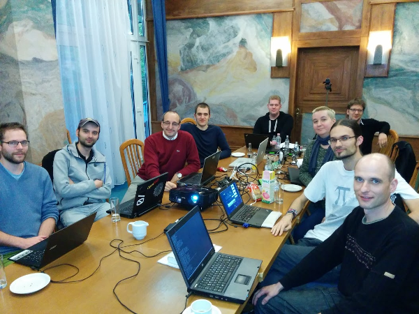

suckless conference 2015, Budapest
==================================

Friday, 2015-10-30
==================

Talks
-----

(11:00-11:15) *Welcome*, Anselm R Garbe

> Anselm opened slcon2 and gave an overview on the final conference schedule.

<video width="600" height="338" controls="" style="display:block;margin:0 auto" poster="https://dl.suckless.org/slcon/2015/slcon-2015-00-arg-welcome.png">
        <source src="https://dl.suckless.org/slcon/2015/slcon-2015-00-arg-welcome.webm" type="video/webm">
	<a href="https://dl.suckless.org/slcon/2015/slcon-2015-00-arg-welcome.webm">slcon-2015-00-arg-welcome.webm</a>
</video>

(11:15-12:00) *suckless core - A suckless userspace foundation*, Laslo Hunhold

> This talk focused on recent developments in the suckless core
> programs, the design and motivation behind them and which issues had been
> faced along the way, including ditching POSIX in some places in favor of
> suckless design principles and consistency.
> Current issues and future plans were discussed in the last part.

<video width="600" height="338" controls="" style="display:block;margin:0 auto" poster="https://dl.suckless.org/slcon/2015/slcon-2015-01-frign-suckless_core.png">
        <source src="https://dl.suckless.org/slcon/2015/slcon-2015-01-frign-suckless_core.webm" type="video/webm">
	<a href="https://dl.suckless.org/slcon/2015/slcon-2015-01-frign-suckless_core.webm">slcon-2015-01-frign-suckless_core.webm</a>
</video>

(12.00-12:45) *stali 2015*, Anselm R Garbe

<video width="600" height="338" controls="" style="display:block;margin:0 auto" poster="https://dl.suckless.org/slcon/2015/slcon-2015-02-arg-stali_2015.png">
        <source src="https://dl.suckless.org/slcon/2015/slcon-2015-02-arg-stali_2015.webm" type="video/webm">
	<a href="https://dl.suckless.org/slcon/2015/slcon-2015-02-arg-stali_2015.webm">slcon-2015-02-arg-stali_2015.webm</a>
</video>

(12:45-13:45) Lunch

(13:45-14:30) *new suckless tools*, Anselm R Garbe

<video width="600" height="338" controls="" style="display:block;margin:0 auto" poster="https://dl.suckless.org/slcon/2015/slcon-2015-03-arg-new_suckless_tools.png">
        <source src="https://dl.suckless.org/slcon/2015/slcon-2015-03-arg-new_suckless_tools.webm" type="video/webm">
	<a href="https://dl.suckless.org/slcon/2015/slcon-2015-03-arg-new_suckless_tools.webm">slcon-2015-03-arg-new_suckless_tools.webm</a>
</video>

(14:30-15:30) *Farbfeld - Rethinking image-formats*, Laslo Hunhold

> This talk discussed the deficiencies of the RGBA color space and
> presented the Farbfeld format to store images in a device independent
> way using the Lab color space.
> Additionally, an alternative to incorporated, namely imposed, image
> compression was discussed, evaluating the advantages over other image
> formats using different kinds of images.

<video width="600" height="338" controls="" style="display:block;margin:0 auto" poster="https://dl.suckless.org/slcon/2015/slcon-2015-04-frign-farbfeld.png">
        <source src="https://dl.suckless.org/slcon/2015/slcon-2015-04-frign-farbfeld.webm" type="video/webm">
	<a href="https://dl.suckless.org/slcon/2015/slcon-2015-04-frign-farbfeld.webm">slcon-2015-04-frign-farbfeld.webm</a>
</video>

(15:30-16:00) Coffee/Tea break

(16:00-16:30) *suckless.org e.V.*, Anselm R Garbe

> Anselm presented the idea of suckless.org e.V.[1][1] and asked
> attendees to join.

<video width="600" height="338" controls="" style="display:block;margin:0 auto" poster="https://dl.suckless.org/slcon/2015/slcon-2015-05-all-suckless_ev.png">
        <source src="https://dl.suckless.org/slcon/2015/slcon-2015-05-all-suckless_ev.webm" type="video/webm">
	<a href="https://dl.suckless.org/slcon/2015/slcon-2015-05-all-suckless_ev.webm">slcon-2015-05-all-suckless_ev.webm</a>
</video>

(16:30-17:30) *suckless.org foundation*, All

(17:30-19:00) Refresh break / check your rooms

(19:00-) Late night social event in Budapest

Saturday, 2015-10-31
====================

Talks
-----

(10:30-10:45) *Opening of day 2*, Anselm R Garbe

<video width="600" height="338" controls="" style="display:block;margin:0 auto" poster="https://dl.suckless.org/slcon/2015/slcon-2015-06-arg-opening_of_day_2.png">
        <source src="https://dl.suckless.org/slcon/2015/slcon-2015-06-arg-opening_of_day_2.webm" type="video/webm">
	<a href="https://dl.suckless.org/slcon/2015/slcon-2015-06-arg-opening_of_day_2.webm">slcon-2015-06-arg-opening_of_day_2.webm</a>
</video>

(10:45-11:30) *Simple Jabber - Divide And Conquer XMPP*, Jan Klemkow ([paper](jan_on_sj.pdf))

> The Extensible Messaging and Presence Protocol ([XMPP][2]) is like the web. It is
> far too complex to be implemented in one program with the Unix philosophy in mind.
> But like the web, you have to deal with it. It is the only open
> and widely used instant messaging protocol on the internet.
> Its extensibility is the main reason that an implementation in a single
> program is nearly impossible. This talk described an approach to master this problem.

<video width="600" height="338" controls="" style="display:block;margin:0 auto" poster="https://dl.suckless.org/slcon/2015/slcon-2015-07-klenkow-simple_jabber.png">
        <source src="https://dl.suckless.org/slcon/2015/slcon-2015-07-klenkow-simple_jabber.webm" type="video/webm">
	<a href="https://dl.suckless.org/slcon/2015/slcon-2015-07-klenkow-simple_jabber.webm">slcon-2015-07-klenkow-simple_jabber.webm</a>
</video>

(11:30-12:00) *Finite state document processing*, Manu Raster

> Mainstream XML processing techniques wastefully consume time
> and memory for example in file format conversions popularly
> known as 'save as...'. This talk presented a less
> wasteful method based on finite-state transducers.

<video width="600" height="338" controls="" style="display:block;margin:0 auto" poster="https://dl.suckless.org/slcon/2015/slcon-2015-08-raster-finite_state_document_processing.png">
        <source src="https://dl.suckless.org/slcon/2015/slcon-2015-08-raster-finite_state_document_processing.webm" type="video/webm">
	<a href="https://dl.suckless.org/slcon/2015/slcon-2015-08-raster-finite_state_document_processing.webm">slcon-2015-08-raster-finite_state_document_processing.webm</a>
</video>

(12:00-13:00) Lunch

(13:00-13:15) Conference fee collection

(13:15-14:15) *UTF-8 everywhere? Writing Unicode compliant software that sucks less*, Laslo Hunhold

> This talk discussed UTF-8 and its history, how and when you have to
> deal with it and which challenges had been faced along the way, evaluating
> its advantages over other character encodings.
> Besides more trivial problems like decoding and encoding, advanced
> issues like string comparison, case conversion and normalization were
> discussed, leading to the conclusion that the POSIX wchar-interfaces
> are broken by design.
> Using suckless principles, problems with the ICU libraries were discussed
> and a midway drawn between total localization and minimalism,
> presenting possible solutions.

<video width="600" height="338" controls="" style="display:block;margin:0 auto" poster="https://dl.suckless.org/slcon/2015/slcon-2015-09-frign-utf-8_everywhere.png">
        <source src="https://dl.suckless.org/slcon/2015/slcon-2015-09-frign-utf-8_everywhere.webm" type="video/webm">
	<a href="https://dl.suckless.org/slcon/2015/slcon-2015-09-frign-utf-8_everywhere.webm">slcon-2015-09-frign-utf-8_everywhere.webm</a>
</video>

(14:15-14:45) Coffee/Tea break

(14:45-15:00) *Formal conference talk closing*, Anselm R Garbe

> Anselm formally closed the conference and it was decided upon the location
> for the upcoming slcon3.

<video width="600" height="338" controls="" style="display:block;margin:0 auto" poster="https://dl.suckless.org/slcon/2015/slcon-2015-10-all-vote.png">
        <source src="https://dl.suckless.org/slcon/2015/slcon-2015-10-all-vote.webm" type="video/webm">
	<a href="https://dl.suckless.org/slcon/2015/slcon-2015-10-all-vote.webm">slcon-2015-10-all-vote.webm</a>
</video>

(15:00-17:00) Hacking

(17:00-) Social event in Budapest

Acknowledgment
--------------
We kindly thank  for
lending us the equipment to record the slcon2 conference videos.

Previous conferences
--------------------
* [slcon 2013](../2013/)

[1]: https://en.wikipedia.org/wiki/Eingetragener_Verein
[2]: http://xmpp.org/
