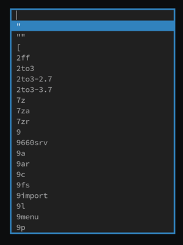

border
======

Description
-----------
This patch adds a border around the dmenu window. It is intended to be used with
the center or xyw patches, to make the menu stand out from similarly coloured
windows.

Download
--------
* [dmenu-border-4.9.diff](dmenu-border-4.9.diff) (19.05.2019)

Authors
-------
* Leon Plickat <leonhenrik.plickat[at]stud.uni-goettingen.de>

border command line option
==========================

Description
-----------
This patch is a derivative of the previous patch. The border witdh can be
specified through the command line using the -bw option. Width defaults to 0.

Create menu with border width 3:

	echo 'item1\nitem2\nitem3' | dmenu -bw 3

Download
--------
* [dmenu-borderoption-20200217-bf60a1e.diff](dmenu-borderoption-20200217-bf60a1e.diff) (17.02.2020)

Authors
-------
* Ben Raskin <ben[at]0x1bi.net>
