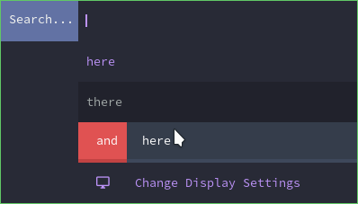

emoji-highlight
=========

Description
-----------
This patch will allow for emojis on the left side with a colored background when selected.

Notes
-----------
To use this please try `echo -e "here\nthere\n:b and here" | ./dmenu -p "Search..." -z 400 -l 20 -i -h -1`

Download
--------
* [emoji-highlight-5.0.diff](emoji-highlight-5.0.diff)

Author
------
* Wayne Wesley <wayne6324@gmail.com>

