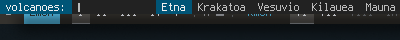
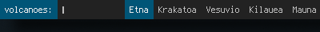

Line height
===========

The patch adds a '-lh' option, which sets the minimum height of a dmenu line.
This helps integrate dmenu with other UI elements that require a particular
vertical size.

Example:

By default, dmenu calculates its height as the height of the font used plus 2.
So when opening dmenu over a panel bar that is 24 pixels high, it would look
like this:

-><-

Despite both the panel and dmenu using the same font (a Terminus 12), dmenu is
shorter and the panel is visible from under the dmenu bar. The appearance can
be even more distracting when using similar colors for background and
selections.

With the option added by this patch, dmenu can be launched with a '-lh 24',
thus completely covering the panel, as shown below:

-><-

The line height value is also used when dmenu is used in 'vertical' mode ('-l' option).

The patch applies cleanly against 4.6 (32f2564dbbbf5aeafb7190a3d35066142f34448f).

Download
--------
* [dmenu-4.6-line-height.diff](dmenu-4.6-line-height.diff)

Author
------
* Xarchus
