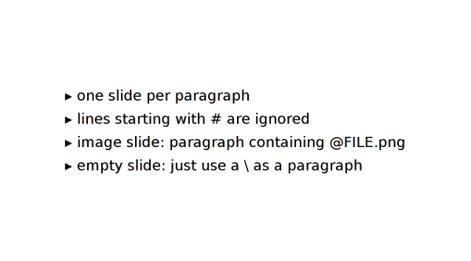

sent
====

Simple plaintext presentation tool.

-><-

sent does not need latex, libreoffice or any other fancy file format, it uses
plaintext files to describe the slides and can include images via
[farbfeld](http://git.2f30.org/farbfeld/about/). Every paragraph represents a
slide in the presentation. Especially for presentations using the [Takahashi
method](https://en.wikipedia.org/wiki/Takahashi_method) this is very nice and
allows you to write down the presentation for a quick lightning talk within a
few minutes.

The presentation is displayed in a simple X11 window colored black on white for
maximum contrast even if the sun shines directly onto the projected image. The
content of each slide is automatically scaled to fit the window so you don't
have to worry about alignment. Instead you can really concentrate on the
content.

Dependencies
------------

* Xlib for building
* farbfeld tools to use images in the presentations (if you don't want to use
  farbfeld, [sent-0.2](http://dl.suckless.org/tools/sent-0.2.tar.gz) was the
  last version with png support, but may lack fixes and further improvements
  since its release)

Demo
----

To get a little demo, just type

	make && ./sent example

You can navigate with the arrow keys and quit with `q`.

(Non-)Features
--------------

* A presentation is just a simple text file
* Each paragraph represents one slide
* Content is automatically scaled to fit the screen
* UTF-8 is supported
* (transparent) images can be displayed (no text on the same slide), farbfeld
  required
* Just around 1000 lines of C.
* No different font styles (bold, italic, underline)
* No fancy layout options (different font sizes, different colors, …)
* No animations
* No support for automatic layouting paragraphs
* No export function. If you really need one, just use a shell script with
  `xdotool` and your favorite screenshot application.
* Slides with exuberant amount of lines or characters produce rendering glitches
  intentionally to prevent you from holding bad presentations

Usage
-----

Edit config.h to fit your needs then build again.

	sent FILE1 [FILE2 ...]

If one FILE equals `-`, stdin will be read. Produce image slides by prepending a
`@` in front of the filename as a single paragraph. Lines starting with `#` will
be ignored. A `\` at the beginning of the line escapes `@` and `#`. A
presentation file could look like this:

	sent
	
	@nyan.png
	
	depends on
	- Xlib
	- farbfeld
	
	sent FILENAME
	one slide per paragraph
	# This is a comment and will not be part of the presentation
	\# This and the next line start with backslashes
	
	\@FILE.png
	
	thanks / questions?

A deeper example can be found in [this
file](http://git.suckless.org/sent/tree/example) from the repository root.

Development
-----------

You can [browse](http://git.suckless.org/sent) its source code repository
or get a copy using the following command:

	git clone http://git.suckless.org/sent

Download
--------

* [sent-0.2](http://dl.suckless.org/tools/sent-0.2.tar.gz) (20151125)
