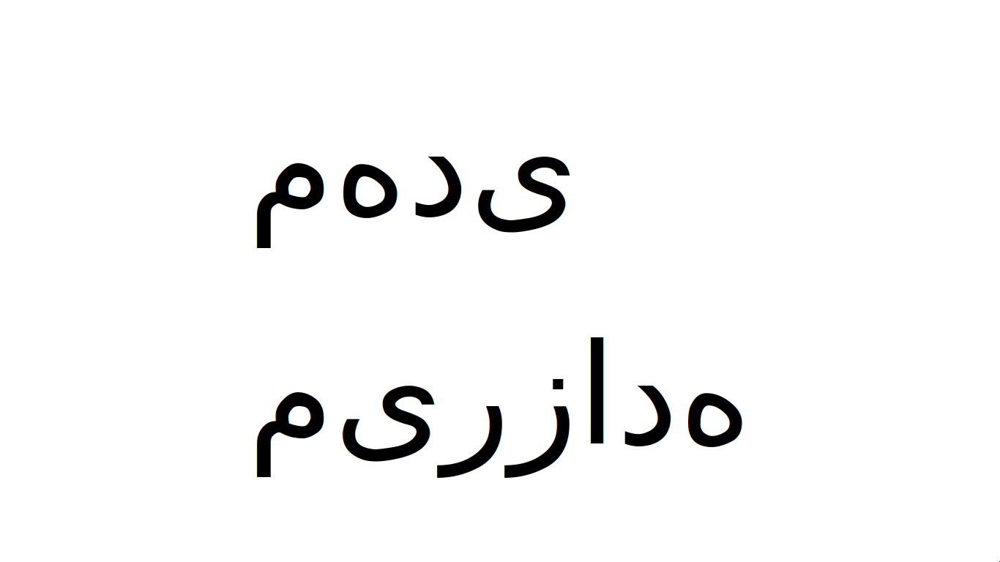
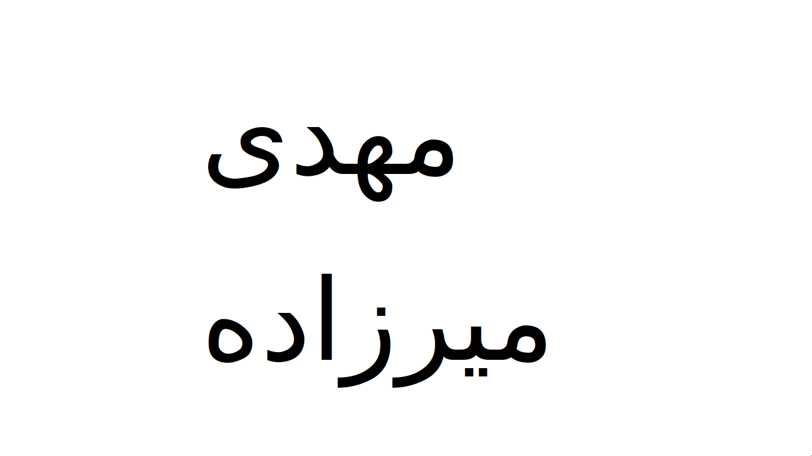

Bidirectional Text
==================

Description
-----------
This patch adds proper support for Right-To-Left languages. (such as Farsi, Arabic or Hebrew)

Texts combining both RTL and LTR languages are displayed correctly in images.
This is achieved using the GNU FriBiDi library, which is an additional dependency for this patch.

without sent-bidi:

with sent-bidi:

Download
--------
* [sent-bidi-20220622-9ed2713.diff](sent-bidi-20220622-9ed2713.diff)

Authors
-------
* Mahdi Mirzade - <http://mahdi.pw>
