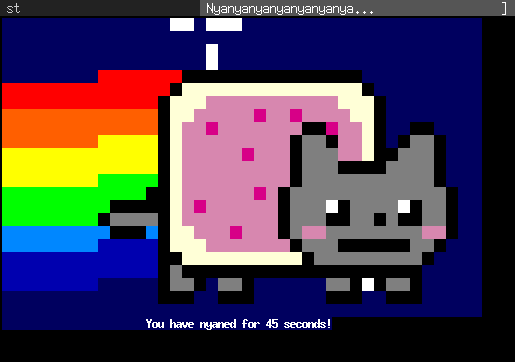

tabbed
======
Simple generic tabbed fronted to xembed aware applications, originally designed
for [surf](http://surf.suckless.org) but also usable with many other
application, i.e. [st](http://st.suckless.org), [uzbl](http://uzbl.org),
[urxvt](http://software.schmorp.de/pkg/rxvt-unicode) and
[xterm](http://invisible-island.net/xterm/)

Development
-----------
You can [browse](http://git.suckless.org/tabbed) its source code repository or get a copy using the following command:

	git clone http://git.suckless.org/tabbed

Download
--------
* [tabbed-0.4.1](http://dl.suckless.org/tools/tabbed-0.4.1.tar.gz) (20120707)

